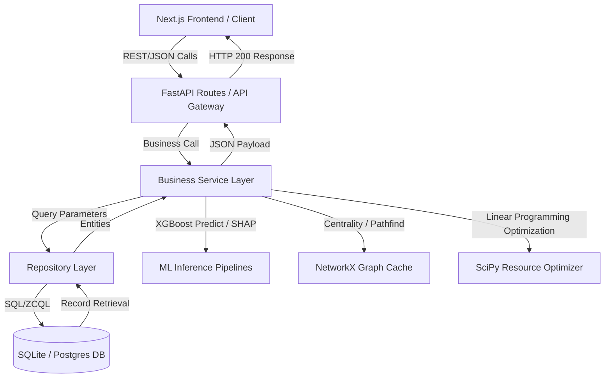

# AI-Driven Crime Analytics & Visualization Platform: Architectural & Database Audit

This document presents a comprehensive, production-grade architectural and database audit of the **AI-Driven Crime Analytics & Visualization Platform**. It details the system's structural layout, technology stack, data flow, API endpoints, and database schemas.

---

## 1. Project Overview & Objective

The platform is designed to transform fragmented, siloed crime records into structured, actionable intelligence. It addresses key law enforcement operational requirements:
1. **Interactive Operational Dashboards**: Consolidating temporal, categorical, and status metrics.
2. **Geospatial Intelligence**: Hotspot mapping, cluster detection, and spatial distribution.
3. **Criminal Network Intelligence**: Graph-based offender link analysis, co-offending tracking, and shortest-path connection mapping.
4. **Predictive Analytics**: Machine learning models forecasting recidivism, hotspot probability, crime risk, and crime categories, with SHAP-based model explanations.
5. **Decision Support & Patrol Planning**: Linear programming-based personnel resource optimization for beat patrols.
6. **Alerts & Monitoring**: Proactive operational rules-based triggers for high-risk predictions or crime clusters.
7. **Executive Reporting**: Programmatic generation of high-fidelity PDF analytics summaries.

---

## 2. Codebase Topology & Monorepo Structure

The project is structured as a unified monorepo divided into frontend client, backend server, data management utilities, and machine learning components:

```text
datathon26/
├── backend/                    # FastAPI Server Core
│   ├── api/                    # Endpoint Routers (v1)
│   ├── app/                    # Entry Point & Lifespan Hooks (main.py)
│   ├── core/                   # Configurations, Database Engines, & Security
│   ├── models/                 # SQLAlchemy Relational Models
│   ├── repositories/           # DB Access Layer (CRUD abstractions)
│   ├── schemas/                # Pydantic Schemas (validation)
│   ├── services/               # Core Business Logic & ML Service Wrappers
│   └── tests/                  # Integration and Unit Tests
├── frontend/                   # Next.js SPA Client (TypeScript)
│   ├── app/                    # Next.js App Router Pages
│   ├── components/             # Reusable UI Components
│   ├── context/                # Authentication & System Context
│   ├── features/               # Dashboard, Geo, Network, Prediction Components
│   ├── hooks/                  # Custom React Hooks
│   └── services/               # Axios API Interceptors
├── ml/                         # Machine Learning Research & Inference Pipelines
│   ├── crime_prediction/       # Crime Category & Risk Score XGBoost Pipelines
│   ├── explainability/         # SHAP explanation interfaces
│   ├── hotspot_prediction/     # Hotspot occurrence prediction models
│   ├── network_analysis/       # NetworkX co-offending calculations
│   └── offender_prediction/    # Recidivism predictive models
├── database/                   # Database Seed & Migration Scripts
│   ├── seed/                   # Seeding modules (Locations, Stations, Crimes)
│   └── migrations/             # SQL Migration Scripts
├── datasets/                   # Static Datasets
│   ├── raw/                    # Raw inputs
│   └── processed/              # Cleaned CSV files (crime_events.csv, etc.)
├── crime_intel.db              # 31.9 MB SQLite Development Database File
├── docker-compose.yml          # Container configuration for local execution
└── README.md                   # Setup documentation
```

---

## 3. Technology Stack & Core Library Bindings

The application uses modern frameworks to handle high volumes of transaction data and complex mathematical computations:

### Backend Architecture
* **FastAPI (v0.100.0+)**: Chosen for its high-performance asynchronous (ASGI) capability, native Pydantic schema validation, and automatic OpenAPI schema generation.
* **Uvicorn (v0.22.0+)**: ASGI server wrapper handling routing and network performance.
* **SQLAlchemy (v2.0.0+)**: Relational Database ORM mapping models to relational tables. Employs connection pooling and lazy/eager loading patterns.
* **SciPy (v1.13.0+)**: Integrated to solve operational linear programming optimization problems for police resource distribution.
* **NetworkX (v3.3)**: Powering the Criminal Network Graph. Constructs nodes and edges, finds connected components, calculates centrality indices, and maps shortest path relationships.
* **XGBoost (v2.0.0+)**: Advanced gradient-boosted decision trees powering the classification and regression models.
* **SHAP (v0.46.0+)**: TreeExplainer implementation to calculate feature impact for every predictions payload, outputting explainable AI arrays.
* **PyJWT & Passlib**: Handling password hashing (Bcrypt) and secure session token generation.

### Frontend Architecture
* **Next.js (v16.2.7) / React (v19.2.4)**: Single Page Application framework with App Router, static optimizations, and typescript integration.
* **TailwindCSS (v4.0)**: Modern styling framework.
* **Leaflet & React-Leaflet**: Geospatial canvas rendering geographic coordinates and crime hotspots.
* **xyflow/ReactFlow**: Drag-and-drop interactive canvas visualizing co-offending networks.
* **Recharts**: Responsive SVG charts representing temporal crime curves and category splits.

---

## 4. Architectural Data Flow & Connections

The systems interact through a decoupled REST API structure. The primary communication lines flow as follows:



1. **System Warmup & Cache Seeding**: During backend startup, a daemon thread initiates `_warmup_network_cache()`. It queries all `criminals`, `crimes`, `locations`, and `participations` through the repository, builds the NetworkX graph, calculates centrality and clusters, and stores them in static memory cache variables on `NetworkAnalyticsService` to eliminate API latency during subsequent user requests.
2. **Dashboard & Analytics Queries**: The client calls `/api/v1/analytics/*` or `/api/v1/geo/*` endpoints. The backend uses SQL aggregation queries to return temporal or spatial data, bypassing network graph caching.
3. **ML Inference**: When an analyst queries offender recidivism, hotspot probability, or crime risk via `/api/v1/predictions/*`, the `PredictionService` checks its static in-memory dictionary `_cached_models`. If empty, it loads the respective `.pkl` model file via `joblib`. Features are processed via the preprocessor, sent to the model for prediction, SHAP values are calculated using `shap.TreeExplainer`, and the prediction is logged in the `predictions` database table before being returned to the user.
4. **Patrol Allocation (SciPy Optimization)**: When a Superintendent triggers resource allocation for a district, `RecommendationService` evaluates the past crimes and severity weights of every police station in that district. It designs a linear programming optimization problem to minimize the difference between target allocations and actual personnel numbers. It uses SciPy's `linprog(method='highs')`, processes fractional allocations with the largest-remainder rounding algorithm, and commits the result to the `resource_allocations` log table.

---

## 5. Relational Database Schema Audit

The local SQLite database (`crime_intel.db`) holds a substantial synthetic dataset. A programmatic audit of the tables reveals the following schema layout and row counts:

### Database Row Counts (Current Development DB)
* **`users`**: **3 rows** (default system personnel accounts).
* **`locations`**: **10 rows** (district-level coordinates).
* **`police_stations`**: **450 rows** (police station coordinates and capacities).
* **`crime_events`**: **50,000 rows** (historical crime incidents).
* **`criminals`**: **50,000 rows** (uniquely identified co-offending suspects).
* **`victims`**: **50,000 rows** (demographic data linked to incidents).
* **`crime_participation`**: **50,000 rows** (association bridge linking criminals to incidents).
* **`predictions`**: **0 rows** (populates dynamically during live user predictions).
* **`alerts`**: **14 rows** (active alerts generated by system rules).
* **`recommendations`**: **3 rows** (decision support records).
* **`resource_allocations`**: **2 rows** (personnel distribution logs).
* **`reports`**: **2 rows** (stored report metadata).
* **`audit_logs`**: **23 rows** (user interaction logs).

### Database Schema Mappings & Relationships

```mermaid
erDiagram
    users {
        int id PK
        string email UNIQUE
        string name
        string password_hash
        string role
        string status
    }
    locations {
        int id PK
        string district
        string state
        float latitude
        float longitude
    }
    police_stations {
        int id PK
        string station_name
        string district
        string state
        int capacity
        float latitude
        float longitude
    }
    crime_events {
        int id PK
        string crime_type
        string crime_category
        string crime_subcategory
        string description
        float severity
        string status
        date crime_date
        time crime_time
        int location_id FK
        int police_station_id FK
        int victim_count
        int accused_count
    }
    criminals {
        int id PK
        string name
        string gender
        float age
        string occupation
        string caste
        float risk_score
        string status
    }
    victims {
        int id PK
        int crime_event_id FK
        string gender
        float age
        string occupation
        int location_id FK
    }
    crime_participation {
        int id PK
        int crime_event_id FK
        int criminal_id FK
        string role
    }
    predictions {
        int id PK
        int crime_event_id FK
        string prediction_type
        string prediction_value
        float confidence_score
    }
    alerts {
        int id PK
        int crime_event_id FK
        string title
        string description
        string severity
        string source
        string status
        int assigned_user_id FK
        string metadata_payload
    }
    recommendations {
        int id PK
        int crime_event_id FK
        string recommendation_text
        string action_type
        string priority
        string status
    }
    resource_allocations {
        int id PK
        string district
        int allocated_asi
        int allocated_chc
        int allocated_cpc
        string solved_allocation_json
    }
    audit_logs {
        int id PK
        int user_id FK
        string action
        string entity_type
        int entity_id
        string details
    }

    locations ||--o{ crime_events : hosts
    locations ||--o{ victims : locates
    police_stations ||--o{ crime_events : manages
    crime_events ||--o{ victims : affects
    crime_events ||--o{ crime_participation : joins
    criminals ||--o{ crime_participation : joins
    crime_events ||--o{ predictions : validates
    crime_events ||--o{ alerts : triggers
    crime_events ||--o{ recommendations : guides
    users ||--o{ alerts : resolves
    users ||--o{ audit_logs : logs
```

### Key Relational Implementations

* **`crime_events` and `locations`**: Standard foreign key mapping (`location_id -> locations.id`). In SQLite, this is a nullable field.
* **`crime_participation` (Bridge Table)**: Joins `criminals` and `crime_events` in a many-to-many relationship (`criminal_id -> criminals.id` and `crime_event_id -> crime_events.id`). This table contains a `role` field that describes the offender's specific role in the crime (e.g., "principal accused", "accessory").
* **Dynamic Migrations Hook**: The server includes an auto-migration script `migrate_database_schema(db_engine)` inside `backend/app/main.py`. This script inspects the SQLite schema at startup and dynamically runs `ALTER TABLE` statements to add fields (like `title`, `description`, `source`, `assigned_user_id`, `metadata_payload`, `updated_at`, `data_payload`) if they are missing. This design ensures that the development database remains compatible with the code during iterative phase upgrades without breaking existing data rows.
