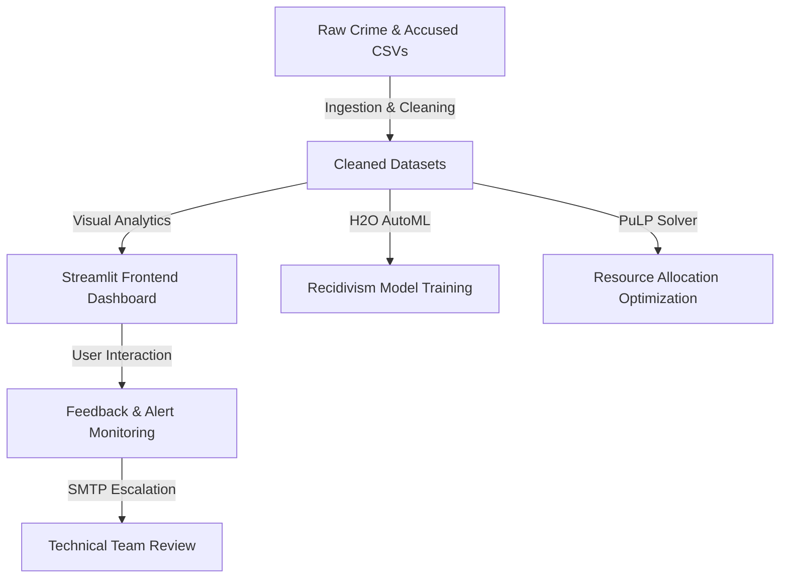

# 01. Project Overview

## Executive Summary
**Predictive Guardians** is an AI-driven, proactive crime analytics and prevention platform designed to empower law enforcement agencies. Modern public safety operations are heavily constrained by siloed data, reactive incident responses, and manual reporting. Predictive Guardians bridges the gap between historical crime data and strategic deployment by processing fragmented criminal records into actionable geospatial, temporal, and demographic intelligence. 

By integrating linear programming for resource optimization and AutoML-driven machine learning models (H2O Stacked Ensembles) for recidivism (repeat offense) prediction, the platform shifts policing from a reactive model to a proactive, data-supported framework.

---

## Relationship to the Datathon Problem Statement
The challenge objective is to **develop a modern AI-powered analytics platform capable of transforming fragmented crime-related records into actionable intelligence.** 

Predictive Guardians addresses this directly through several core modules:
* **Interactive Dashboards & District Drilldowns**: Streamlit interface parsing historical records for demographic, caste, and occupation profiles.
* **Geospatial Crime Maps & Hotspot Detection**: Dynamic maps using Folium, heatmaps, and DBSCAN density-based clustering to automatically discover and highlight high-density crime coordinates.
* **Predictive Risk Scoring**: Machine learning models designed to predict the probability of recidivism (repeat offense) based on demographic profiles and criminal history.
* **Optimized Resource Allocation**: Linear programming (using the PuLP optimizer) that automatically distributes police personnel (Assistant Sub-Inspectors, Head Constables, and Police Constables) across beats based on normalized crime severity weights.
* **Continuous Learning & Feedback Loop**: Integrating user feedback, live threshold monitoring, automated email alert escalations to developers, and stakeholder meeting invitations to ensure the system adapts dynamically.

---

## Intended Users
1. **Police Commissioners and District SPs (Superintendents of Police)**: Strategic users who monitor district-level trends, adjust sanctioned personnel strengths, and oversee high-level resource distribution.
2. **Station House Officers (SHOs) and Beat Officers**: Tactical users who review local beat allocations, analyze hotspot clusters, and investigate repeat offender likelihoods.
3. **Technical Administrators / Developers**: Maintainers who respond to system health alerts, collect feedback patterns, and oversee model retraining runs.

---

## High-Level Workflow

---

## Key Capabilities

| Capability | Description | Core Technology |
| :--- | :--- | :--- |
| **Geospatial Analysis** | Generates Choropleth district maps and Heatmaps overlaying cluster locations. | `folium`, `plotly.express`, `DBSCAN` |
| **Recidivism Prediction** | Estimates repeat offense probability using categorical and numerical features. | `H2O.ai MOJO`, `scikit-learn` |
| **Resource Optimization** | Allocates CHC, CPC, and ASI officers to beats to maximize coverage based on crime severity. | `PuLP`, `Linear Programming` |
| **Alert and feedback loops** | Triggers email notifications if user rating averages drop or negative feedback surges. | `smtplib`, `Streamlit Progress Bars` |

---

## User Journey

### Scenario: Proactive Beat Patrol Setup by a District Superintendent
1. **Login & Dashboard Access**: The Superintendent opens the Predictive Guardians app and lands on the **Home Page**, where they are introduced to the core system components.
2. **Reviewing High-Crime Districts**: The user navigates to the **Crime Pattern Analysis** tab. They inspect the *Choropleth Map* to identify which districts are experiencing the highest volume of crimes, victim counts, or accused counts.
3. **Investigating Hotspots**: They zoom in on a specific district, selecting a date range and crime categories. The map renders a *Folium Heatmap* with specific *DBSCAN red marker clusters*, revealing where crime hotspots are concentrated down to coordinate coordinates.
4. **Offender Profiling**: They switch to the **Criminal Profiling** tab, reviewing histograms of offender ages, caste distributions, and occupations within the high-incidence areas to understand the socio-demographic drivers of crime.
5. **Assessing Repeat Offender Risk**: They enter the profile details (age, caste, profession, and city) of a known suspect in the **Predictive Modeling** tab. The H2O MOJO model outputs whether this suspect is likely to commit a repeat offense.
6. **Optimizing Patrol Resources**: Armed with the normalized severity score of the beats, the Superintendent visits the **Police Resource Allocation** page. They input the sanctioned strength for ASIs, CHCs, and CPCs, and run the optimization algorithm. The system outputs a table of beats with exact personnel counts.
7. **Submitting Performance Feedback**: Finding the resource allocation layout highly effective, but wanting deeper temporal trend visualizations, they submit a rating of `4` via the **Continuous Learning & Feedback** tab with comments. If their rating falls below critical levels, an alert is automatically fired to developers.
