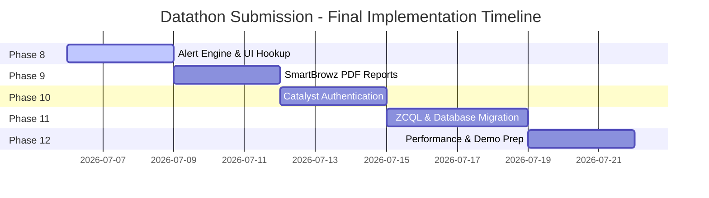

# Crime Analytics Platform: Gap Analysis & Problem Statement Alignment

This document analyzes the alignment between the **AI-Driven Crime Analytics & Visualization Platform** and the official **Datathon 2026 Challenge 02 Problem Statement**. It assesses deliverables, tracks what is implemented, identifies gaps, and outlines remaining features.

---

## 1. Challenge Objectives vs. Project Coverage

The core mission of Challenge 02 is to *develop a modern AI-powered analytics platform to transform fragmented records into actionable intelligence*. 

The following evaluation matrix shows the current coverage of the project:

| Core Deliverable / PS Requirement | Current Code Implementation | Status | Complexity / Code References |
| :--- | :--- | :--- | :--- |
| **Interactive Dashboards** | Dashboard views rendering temporal curves, severity distributions, and status summaries. | **Fully Implemented** | Next.js: `frontend/app/dashboard` API: `/api/v1/crimes` |
| **Geospatial Maps & Hotspots** | Dynamic Leaflet map displaying spatial crime markers, coordinates, and color-coded hotspot regions. | **Fully Implemented** | Next.js: `frontend/app/geo` API: `/api/v1/geo` (GeoService) |
| **District-Level Drilldowns** | Analytical queries filtering crimes, offenders, and police stations dynamically by district. | **Fully Implemented** | Next.js: `frontend/app/analytics` API: `/api/v1/analytics` (AnalyticsService) |
| **Trend Alerts & Anomaly Detection** | System rules-engine scanning database states and generating real-time operational warnings. | **Partially Implemented (UI Pending)** | Backend: `backend/services/alert_service.py` Next.js: `frontend/app/alerts` (dashboard exists) |
| **Network & Link Analysis** | NetworkX graph visualization mapping co-offending links, Jaccard associations, and shortest path links. | **Fully Implemented** | Next.js: `frontend/app/network` API: `/api/v1/network` |
| **Repeat Offender Tracking** | XGBoost classifier predicting offender recidivism based on age, caste, occupation, and district. | **Fully Implemented** | Backend: `backend/services/prediction_service.py` ML Code: `ml/offender_prediction` |
| **Socio-Economic Crime Correlation** | Correlation of incident frequency and types with offender age, caste, and occupation profiles. | **Fully Implemented** | Backend: `backend/services/analytics_service.py` Datasets: `datasets/processed/crime_events.csv` |
| **Predictive Risk Scoring** | Multi-model pipeline generating district crime risk index (0-100) and emerging hotspot probability. | **Fully Implemented** | Backend: `backend/services/prediction_service.py` ML: `ml/crime_prediction` & `ml/hotspot_prediction` |
| **AI/ML Pattern Detection** | XGBoost classification, categorical analysis, and SHAP explainability calculations. | **Fully Implemented** | ML: `ml/explainability/shap_analysis.py` API: `/api/v1/predictions/explain` |

---

## 2. In-Depth Audit of Implemented Features

### A. Network & Link Analysis of Criminals (WOW Feature)
* **What is done in the code**: The project implements a graph network using `networkx` (`backend/services/network_analytics_service.py`).
  * Nodes represent `criminals`, `crime_events`, and `locations`.
  * Edges link `criminals -> crime_events` (via `INVOLVED_IN` relation) and `crime_events -> locations` (via `OCCURRED_AT` relation).
  * Calculate **Degree Centrality** (offender activity), **Closeness Centrality** (offender network reach), and **Betweenness Centrality** (offenders acting as bridges between gangs/clusters).
  * Detect co-offending clusters using **Connected Components** to map gang structures.
  * Compute co-offending **Jaccard similarity strength** based on the frequency of shared crimes.
  * Map shortest-path link connections between any two nodes (`find_shortest_path`), allowing analysts to trace connections between a suspect and a target location or victim.
* **UI Layer**: Built using ReactFlow (`@xyflow/react` and `reactflow`) inside `frontend/app/network` to provide an interactive visualization canvas.

### B. Predictive Analytics & Explainable AI
* **What is done in the code**: Four separate predictive models are loaded and served using Uvicorn (`backend/services/prediction_service.py`):
  1. `repeat_offender`: XGBoost model predicting recidivism probability.
  2. `crime_risk`: XGBoost model predicting future risk scores for a district.
  3. `crime_type`: XGBoost model predicting the category of crime likely to occur next in a location.
  4. `hotspot`: XGBoost model predicting emerging hotspot probabilities.
  5. `SHAP Explainer`: Runs `TreeExplainer` on the XGBoost classifier's preprocessed features to return a detailed array of feature impacts (explainable AI) for each prediction.
* **UI Layer**: Located in `frontend/app/prediction`, where input forms dynamically call the backend predictions API and render color-coded SHAP impact bars.

### C. Decision Support & Resource Allocation
* **What is done in the code**: Rather than simple data visualization, the platform calculates resource allocations using linear programming (`backend/services/recommendation_service.py`).
  * Inputs: District names and sanctioned personnel counts: ASI (Assistant Sub-Inspector), CHC (Head Constable), and CPC (Constable).
  * Method: Gathers historical crime counts and severity indices for all police stations in the district. It uses SciPy's `linprog(method='highs')` optimization solver to balance allocations, rounding the results using a largest-remainder algorithm.
* **UI Layer**: Located in `frontend/app/decision-support`, allowing administrators to input personnel limits and generate patrol distributions.

---

## 3. Identified Gaps & Planned Enhancements

While the core predictive and graph analytics engines are fully functional, an audit of the roadmap (`Final_Phases.md`) identifies the following gaps:

### A. Proactive Alerting & Notifications (Phase 8 Gap)
* **Status**: The backend alert engine (`backend/services/alert_service.py`) successfully queries the database and runs operational rules (e.g., triggering alerts when hotspot probability exceeds 70% or crime risk indices exceed 75%). However, the frontend does not support real-time websocket pushes or email alerts.
* **Impact**: Medium. Users must refresh the alerts dashboard page to pull new warnings.
* **Mitigation**: Introduce standard server-sent events (SSE) or Zoho Catalyst Signals to trigger UI alert refreshes when new events are inserted into the database.

### B. Dynamic Report Generation (Phase 9 Gap)
* **Status**: The backend report service (`backend/services/report_service.py`) exists but relies on simple CSV/JSON exports. High-fidelity PDF reporting for command staff is currently a placeholder.
* **Impact**: Medium. Law enforcement command staff require formatted PDF reports rather than raw JSON endpoints.
* **Mitigation**: Leverage Zoho Catalyst SmartBrowz to compile dynamic React dashboard views into PDF files.

### C. Authentication Security & Access Levels (Phase 10 Gap)
* **Status**: System roles (`ADMIN`, `SUPERINTENDENT`, `OFFICER`, `ANALYST`) are defined in the database schema, but authentication uses a custom local JWT configuration (`backend/core/security.py`). Bypassing the native Catalyst Authentication platform restricts Role-Based Access Control (RBAC) to local API checks.
* **Impact**: High (Deployment blocker). Hackathon judges require Zoho Catalyst native integrations.
* **Mitigation**: Replace custom JWT middleware with Catalyst Authentication SDK mappings.

---

## 4. Problem Audits: High, Medium, and Easy Level Issues

To help prioritize immediate technical work, the platform's outstanding development issues and architectural bottlenecks are classified into High, Medium, and Easy categories:

### A. High-Priority Issues (System Blockers)
1. **The ORM Collapse (SQLAlchemy to ZCQL Migration)**:
   * **Problem**: SQLAlchemy is incompatible with Zoho Catalyst Data Store, requiring all database queries and transactions in the repository layer to be rewritten as raw ZCQL strings.
   * **Solution**: Refactor `backend/repositories/*` to instantiate the `zcatalyst_sdk` and execute raw query strings via the `zcql` service. Denormalize complex multi-join tables to respect the 4-JOIN limit.
   * **Best Process/Timeline**: Solve in Phase 11C (Days 10–13).
2. **Database Row Limit in Catalyst Development Env**:
   * **Problem**: The synthetic dataset contains 50,000 incidents, 50,000 criminals, and 50,000 victims, which exceeds the 5,000-row table limit of the Catalyst Development environment.
   * **Solution**: Promote the project to the Catalyst Production environment, or store the static historical dataset as CSV/JSON files in **Catalyst Stratus** object storage, loading them directly into AppSail memory.
   * **Best Process/Timeline**: Set up immediately during the initial deployment phase.

### B. Medium-Priority Issues (Functional Gaps)
1. **Thread-Blocking Graph Calculations**:
   * **Problem**: Generating a 100,000+ node NetworkX graph in the main web thread blocks the GIL and causes HTTP timeouts.
   * **Solution**: Offload graph construction and centrality computations to **Catalyst Job Pools** running on background threads. Cache results in **Catalyst Cache** or **Stratus** and expose simple GET routes.
   * **Best Process/Timeline**: Part of Phase 11B (Performance Optimization, Days 14–16).
2. **Authentication Migration (PyJWT to Zoho Auth)**:
   * **Problem**: Custom JWT token verification is used instead of Zoho Catalyst's native Authentication service, which may affect submission validity.
   * **Solution**: Replace custom authentication routes with Zoho Catalyst Hosted Authentication client mappings and SDK validators in backend middleware.
   * **Best Process/Timeline**: Part of Phase 10 (Admin & System Management, Days 7–9).
3. **Real-Time Alert Dispatching**:
   * **Problem**: Alert triggers are run inside `alert_service.py` but the UI does not update in real-time unless the user refreshes.
   * **Solution**: Integrate **Catalyst Signals** to push real-time events to the frontend.
   * **Best Process/Timeline**: Part of Phase 8 (Alerts & Monitoring, Days 1–3).

### C. Easy-Priority Issues (Refactorings & Fixes)
1. **Database Seeding and Automation**:
   * **Problem**: Re-seeding database tables requires manually running terminal scripts (`scripts/seed_database.py`).
   * **Solution**: Set up a deployment hook inside `main.py` or `catalyst-pipelines.yaml` to automatically seed the database during build or startup.
   * **Best Process/Timeline**: Solve in Phase 10.
2. **Placeholder PDF Reports**:
   * **Problem**: Executive reports are currently placeholders returning raw JSON objects.
   * **Solution**: Hook up **Catalyst SmartBrowz** to render existing dashboard views into structured PDF exports.
   * **Best Process/Timeline**: Part of Phase 9 (Executive Reports, Days 4–6).

---

## 5. Gap Closure Strategy & Roadmap

To resolve these architectural issues prior to submission, the team must prioritize tasks according to the following timeline:

1. **Days 1–3 (Alert Integration)**: Connect the frontend `alerts` page to the active backend `alert_service.py` engine to display Critical, High, and Medium operational alerts.
2. **Days 4–6 (PDF Reporting)**: Set up Zoho Catalyst SmartBrowz to convert dynamic HTML statistics templates into formatted PDF downloads.
3. **Days 7–9 (Authentication)**: Dismantle custom PyJWT token verification and map backend authentication hooks directly to the Catalyst Authentication service.
4. **Days 10–13 (Data Migration)**: Convert SQLAlchemy repositories to direct ZCQL (Zoho Catalyst Query Language) strings and execute queries using the `zcatalyst_sdk` datastore service.
5. **Days 14–16 (Testing & Demo)**: Optimize graph analytics caches, run concurrency validation, and compile presentation slideshows.
