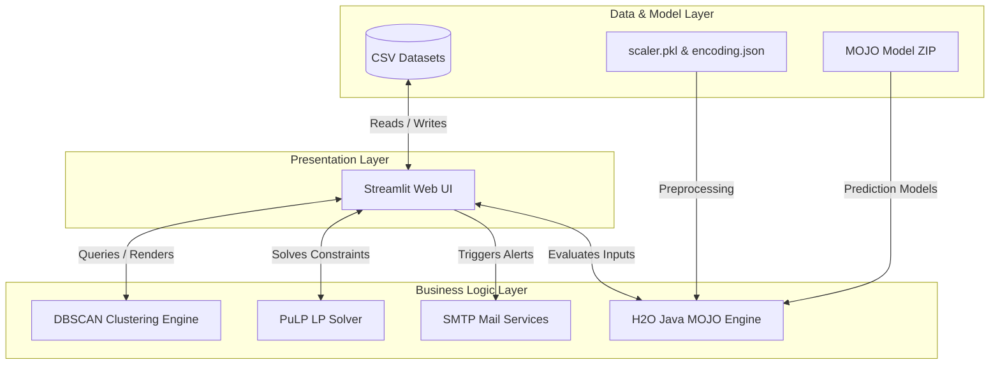
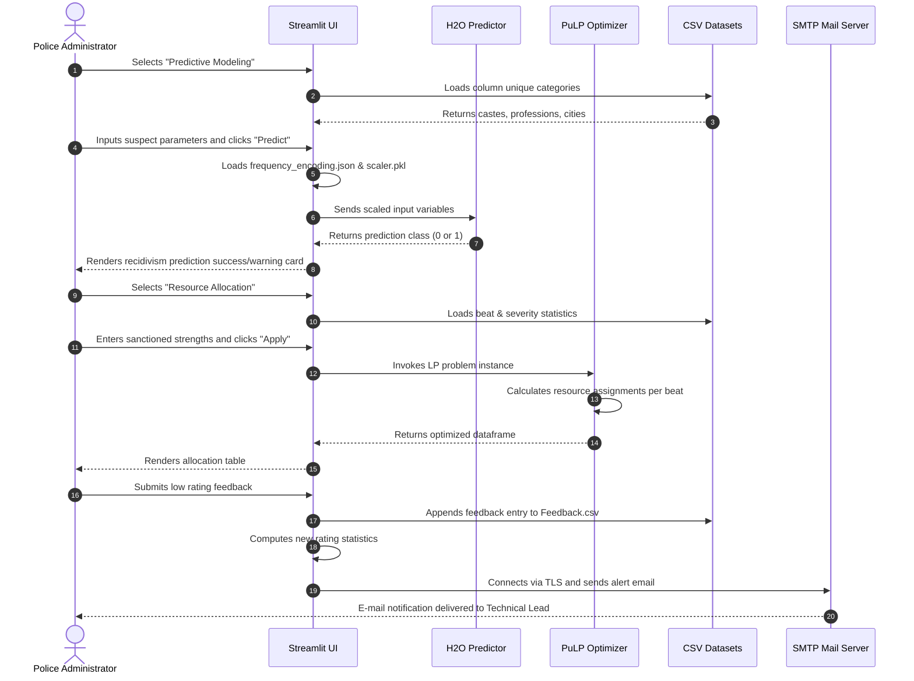

# 03. Architecture

This document describes the architectural design of Predictive Guardians, including its layering, component interaction, and engine details.

---

## High-Level System Architecture

Predictive Guardians is built on a modular three-tier architecture:
1. **Presentation Layer (Frontend)**: A Python-based interactive dashboard built with Streamlit.
2. **Business Logic & Computation Layer (Backend)**: Python modules handling geospatial calculation (DBSCAN), linear programming solvers (PuLP), and communication services (SMTP mail clients).
3. **Data & Model Layer (Storage)**: Flat file databases (CSV files) storing preprocessed and real-time user feedback data, combined with serialized machine learning models (H2O MOJO models & scikit-learn standardizers).

---

## Layer Descriptions

### 1. Presentation Layer (Frontend)
Built using **Streamlit (v1.22.0+)**. It provides a single-page app layout with vertical sidebar navigation powered by `streamlit-option-menu`.
* **Dynamic Visualization Components**:
  * **Choropleth Maps**: Maps Karnataka district lines using Plotly Express, overlaying District-level crime statistics.
  * **Crime Hotspots**: Renders Folium heatmaps of crime density, and injects custom JavaScript-rendered map view components into Streamlit using `streamlit-folium`.
  * **Socio-demographic Graphs**: Draws distributions, pie charts, and horizontal bars using Plotly Express.
  * **Resource tables**: Displays tabular solutions generated by the linear programming solver.
  * **Alert meters**: Renders system health ratings using native Streamlit progress bars.

### 2. Business Logic & Computation Layer (Backend)
This layer contains the core mathematical and algorithmic elements:
* **Density-Based Clustering (DBSCAN)**: Implemented via `scikit-learn` to automatically locate geographic hotspots. Grouping coordinates within a defined radius (epsilon) allows the engine to isolate cluster centroids.
* **Linear Programming Solver (PuLP)**: Implements simplex optimization algorithms to maximize police beats coverage under fixed personnel availability constraint lists.
* **MOJO Deployment Framework**: Leverages H2O's Model Object, Optimized (MOJO) runtime. The frontend imports the model and executes predictions locally via python's `h2o.import_mojo()`. It relies on a local Java Runtime Environment (JRE) to run the predictive scoring engine.
* **Communication Pipelines**: Uses Python's native `smtplib` and `email` packages to format multipart MIME messages, attach CSV logs, and establish TLS connections with Google SMTP servers for escalations.

### 3. Data & Model Layer (Storage)
Instead of a database server (like MySQL or PostgreSQL), the platform uses **flat file persistence**:
* **Read Storage**: Packaged CSV files represent pre-cleaned historical crime and profiling databases.
* **Write Storage**: A local file `Component_datasets/Feedback.csv` is updated on user submissions.
* **Model Serialization**: Uses joblib pickle structures for scikit-learn preprocessing objects, standard JSON files for category mappings, and zipped bytecode files for AutoML ensembles.

---

## Module Interaction Diagram

This diagram displays the lifecycle of a user session traversing the application layers.

