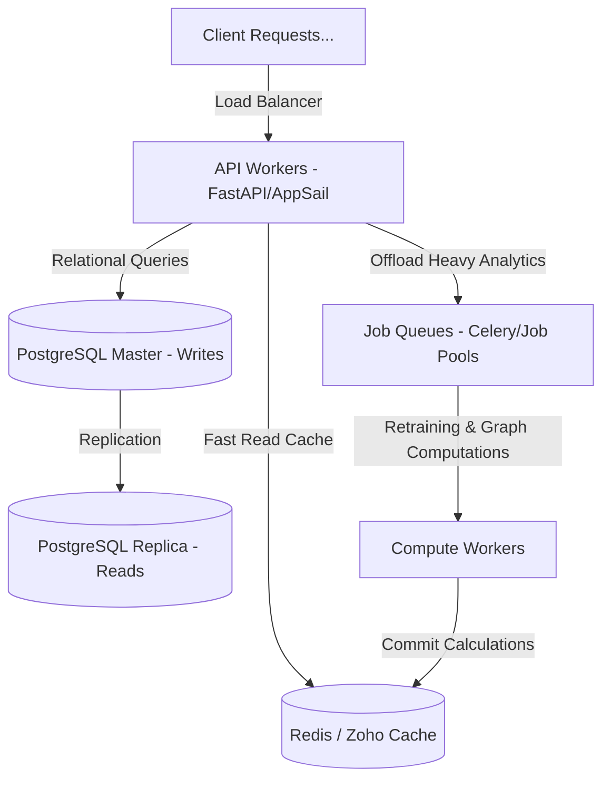

# High-Concurrency Scalability & Performance Optimization Plan (5,000+ Concurrent Users)

This document provides a technical blueprint to ensure the **AI-Driven Crime Analytics & Visualization Platform** remains highly performant and stable under concurrent loads of **5,000+ active users**. It identifies existing computational and database bottlenecks and details mitigation strategies.

---

## 1. Existing System Bottlenecks

1. **CPU-Intense Graph Traversals**:
   * *Problem*: The criminal network contains **50,000 criminals**, **50,000 crimes**, and **50,000 participations**. Building a NetworkX graph with 100,000+ nodes and edges in-memory takes 2–5 seconds. Computing Betweenness Centrality on a graph of this size is an $O(V \cdot E)$ operation that blocks the Python GIL (Global Interpreter Lock), halting all API routes.
   * *Current Code*: The system implements class-level static caching (`_cached_graph`, `_cached_centrality`, etc.) inside `NetworkAnalyticsService` and runs a startup daemon thread `_warmup_network_cache()`. However, this relies on local, single-process RAM. In a multi-worker production environment (e.g., Uvicorn with 4 workers), each worker builds its own copy of the graph, multiplying RAM consumption.
2. **Database Write Locking (SQLite Constraint)**:
   * *Problem*: SQLite uses file-level locking. Under concurrent write loads (e.g., multiple officers logging crimes or predictions saving risk metrics simultaneously), transactions will fail with `sqlite3.OperationalError: database is locked`.
3. **ML Pickle Loading Latency**:
   * *Problem*: The system uses 4 distinct XGBoost `.pkl` files (totaling over 3 MB). Reading these files from disk on every request would add 100–300ms of API latency.
   * *Current Code*: Models are cached in-memory inside `PredictionService` (`_cached_models`). However, a worker restart or container cold start incurs a significant startup penalty.
4. **N+1 SQL Queries**:
   * *Problem*: Querying 50,000 crime events without eager loading results in thousands of separate SQL requests to fetch location and officer details.

---

## 2. Architectural Optimizations for 5,000+ Concurrent Users

To support high concurrent loads, the platform's architecture must transition from in-process execution to distributed services:



### Vector 1: Asynchronous Graph Computing & Distributed Caching
* **Implementation**:
  * Replace the local class-level variables in `NetworkAnalyticsService` with a distributed in-memory cache (**Redis** or **Zoho Catalyst Cache**).
  * Move graph serialization from raw JSON to **MessagePack** or compressed protocol buffers to minimize network payload size.
  * Move the `build_graph()`, centrality calculations, and cluster detection tasks from the web request threads to a background worker process (**Celery** or **Zoho Catalyst Job Pools**).
  * Configure a nightly Cron job to run these calculations in the background. The API workers will then only read pre-calculated JSON graphs and centrality lists from the cache, reducing API response times to under 15ms.

### Vector 2: Database Scaling & Connection Pooling
* **Implementation**:
  * **Migrate from SQLite to PostgreSQL** in production.
  * Configure **SQLAlchemy Connection Pooling** in `backend/core/database.py` with custom thresholds:
    ```python
    engine = create_engine(
        settings.DATABASE_URL,
        pool_size=50,          # Open 50 persistent connections per worker
        max_overflow=100,      # Allow up to 100 overflow connections under high load
        pool_timeout=30,       # Wait 30s max for a connection from pool
        pool_recycle=1800      # Recycle connections after 30 minutes
    )
    ```
  * Implement **Read/Write Splitting**: Route write transactions (e.g., creating crimes, logging predictions) to a primary PostgreSQL instance, and distribute analytical read requests (e.g., maps, charts, listings) across multiple read replicas.
  * **Database Indexing**: Enforce composite B-Tree indexes on high-frequency query columns in the relational database:
    * `crime_events`: `(district, crime_date, severity)`
    * `crime_participation`: `(criminal_id, crime_event_id)`
    * `criminals`: `(risk_score, status)`
    * `locations`: `(district)`

### Vector 3: Eliminating N+1 Queries & Implementing Pagination
* **Implementation**:
  * Enforce **Eager Loading** for all relationships using SQLAlchemy `joinedload` or `selectinload`. For example, inside `AlertService`:
    ```python
    # Eagerly loads both CrimeEvent and Location in a single query instead of N queries
    preds = self.db.query(Prediction).options(
        joinedload(Prediction.crime_event).joinedload(CrimeEvent.location)
    ).all()
    ```
  * Enforce API pagination on all listings endpoints. Replace `SELECT * FROM crime_events` with key-based pagination (using `created_at` or `id` offsets) capped at a maximum of 100 rows per request.

### Vector 4: ML Inference Scalability & Batching
* **Implementation**:
  * Preload all models into RAM during container startup using FastAPI lifespan hooks.
  * Implement **Batch Inference**: Under high concurrent request volumes, group incoming classification requests into micro-batches (e.g., every 50ms) to run inference on multiple data rows in a single model execution, maximizing CPU/GPU utilization.
  * Cache predictions using a hash of the input parameters as the key. If an analyst queries recidivism for a criminal with identical demographic features (age, caste, occupation, district), return the cached score directly.

### Vector 5: Frontend Performance & Map Rendering
* **Implementation**:
  * **Leaflet Marker Clustering**: Rendering 50,000 individual markers on a browser map will cause UI lag. Implement `react-leaflet-markercluster` to group markers dynamically based on map zoom levels.
  * **React Virtualization**: For large data tables (such as the list of 50,000 criminals or crimes), use `react-window` or `react-virtualized` to only render the rows currently visible in the user's viewport.
  * **Dynamic Imports & Code Splitting**: Lazy-load heavy visualization libraries (like Leaflet and ReactFlow) using Next.js `dynamic()` imports to minimize the initial JS bundle size.
