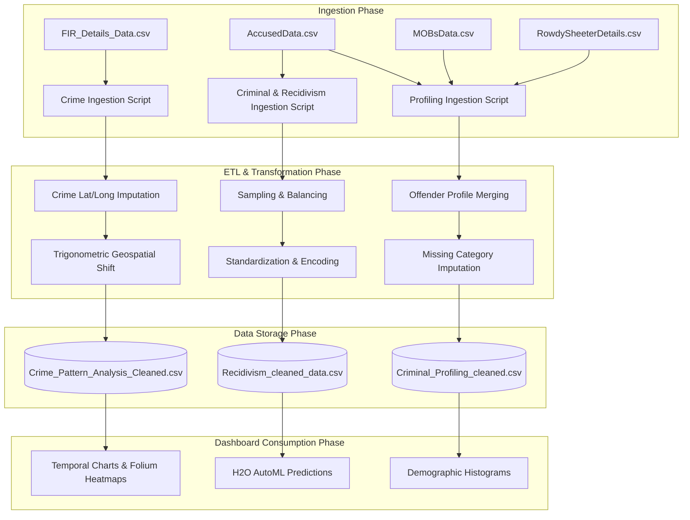
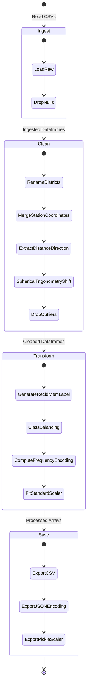

# 04. Data Flow

This document details the data lifecycle, data transformation processes, feature engineering steps, and interactive routing flows in the Predictive Guardians platform.

---

## Data Lifecycle Overview

The following diagram tracks the progression of data from raw police records through the cleaning and transformation pipelines, and finally into storage and interactive rendering.

---

## Detailed Processing Pipelines

### 1. Ingestion Phase
Raw source data is read from the `../datasets/` directory. (Note: These files are not checked into the repository due to size limitations, but are processed by the scripts under the component folders).
* **Source Files**:
  * `FIR_Details_Data.csv`: Historical FIR registers containing incident dates, unit names, crime categories, and distances from police stations.
  * `AccusedData.csv`: Individual listings of arrests, demographics (age, sex, caste, profession), and unique identifiers (`Person_No`, `Arr_ID`).
  * `MOBsData.csv`: Modus Operandi Bureau listings describing crime methods and categories.
  * `RowdySheeterDetails.csv`: Detailed records on habitual offenders, classifications, and previous crimes.
  * `Polce_Stations_Lat_Long.csv`: Reference dataset mapping police unit names to their geographic coordinate centers.

---

## 2. Feature Engineering & Transformations

### A. Geolocational Coordinate Imputation (Crime Pattern Analysis)
In the raw FIR dataset, specific coordinates of crime locations are often missing or marked as default. The system reconstructs coordinates using the police station's baseline position and the recorded relative distance and direction.

1. **Station coordinates merge**:
   The crime log is merged with `Polce_Stations_Lat_Long.csv` on the `UnitName` column. Missing coordinate rows are initially filled with the coordinates of their parent police station.
2. **Text parsing**:
   The `Distance from PS` text column (e.g. *"5 KM North"*, *"300m East"*) is parsed using regex patterns to extract the distance value and direction:
   * Meters and feet values are automatically scaled and converted into kilometers.
   * Directions are mapped to `'NORTH'`, `'SOUTH'`, `'EAST'`, or `'WEST'`.
3. **Trigonometric Coordinate Calculation**:
   To shift the latitude and longitude coordinates by a physical distance in kilometers, the values are converted to spherical radians:
   $$\text{Angular Distance } (\theta) = \frac{\text{Distance in KM}}{\text{Earth's Radius } (6371.0\text{ km})}$$
   * **Shift Calculations**:
     * **NORTH**: $\text{New Latitude} = \text{Degrees}(\text{Latitude}_{\text{radians}} + \theta)$
     * **SOUTH**: $\text{New Latitude} = \text{Degrees}(\text{Latitude}_{\text{radians}} - \theta)$
     * **EAST**: $\text{New Longitude} = \text{Degrees}(\text{Longitude}_{\text{radians}} + \theta)$
     * **WEST**: $\text{New Longitude} = \text{Degrees}(\text{Longitude}_{\text{radians}} - \theta)$
4. **Outlier Filtering**:
   Coordinates outside the bounding box of Karnataka state ($\text{Lat } \in [11, 19], \text{Lon } \in [74, 78]$) are pruned.

### B. Recidivism Class Label Generation
The target class label `Recidivism` is not present in the raw data. The ETL process generates it based on arrest tracking:
1. The accused dataset is grouped by `Person_No` and `Arr_ID`.
2. The cohort size of each group is evaluated:
   $$\text{Recidivism} = \begin{cases} 1 & \text{if } \text{count}(\text{Person\_No}) > 1 \\ 0 & \text{otherwise} \end{cases}$$
3. This creates a binary classification label denoting whether a suspect has been associated with multiple entries.

### C. Class Balancing (Sampling Pipeline)
The generated dataset is highly imbalanced. The ETL pipeline uses an oversampling/undersampling hybrid method:
1. **Oversampling**: Uses `RandomOverSampler` to duplicate rows from the minority class (non-repeat offenders) until they balance the majority class.
2. **Undersampling**: Uses `RandomUnderSampler` to reduce the count of majority class records (repeat offenders).
3. **Combination**: Concatenates both sampled datasets to create a balanced dataset:
   $$\text{Balanced Data} = \text{Concat}(\text{Oversampled Data}, \text{Undersampled Data})$$

### D. Frequency Encoding and Scaling (ML Pipeline)
For categorical variables (`District_Name`, `Caste`, `Profession`, `PresentCity`), the system uses frequency encoding to represent categories numerically without expanding dimensions:
1. Calculate occurrence counts:
   $$\text{Encoded Value} = \text{Count}(\text{Category Value})$$
2. Save values in `frequency_encoding.json` for mapping user inputs in real-time.
3. Apply standard scaling:
   $$\text{Scaled Value} = \frac{\text{Value} - \mu}{\sigma}$$
   The calculated mean ($\mu$) and variance ($\sigma$) parameters are stored in `scaler.pkl`.

### E. Normalized Crime Severity Calculation (Resource Allocation)
To allocate police officers to beats, the system evaluates crime severity scores:
1. Map raw offense groups to ten general crime categories.
2. Compute beat severity:
   $$\text{Crime Severity per Beat} = \sum_{i \in \text{Beat Crimes}} \text{Weight}(\text{Crime Category}_i)$$
3. Normalize beat severity by district:
   $$\text{Normalised Crime Severity}_{\text{beat}} = \frac{\text{Crime Severity per Beat}}{\sum_{j \in \text{District Beats}} \text{Crime Severity per Beat}_j}$$

---

## 3. End-to-End Processing Pipeline Diagram

This sequence traces the data transformations performed by the code in the repository:

