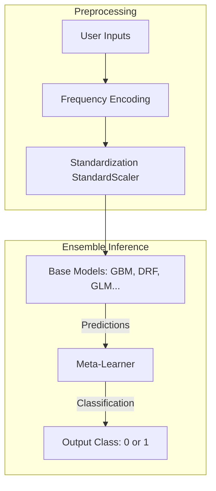

# 06. Machine Learning Analysis

This document describes the machine learning objectives, training methodologies, feature preprocessing steps, prediction pipelines, and limitations of the Predictive Guardians system.

---

## 1. Machine Learning Objectives

The platform includes two machine learning objectives to support proactive policing:
1. **Recidivism Prediction (Repeat Offense Prediction)**: Classifies whether a suspect with a prior arrest history is likely to commit a crime again.
2. **Crime Hotspot Detection (Pattern Detection)**: Groups geo-coordinates into spatial clusters using density-based algorithms.
3. **Crime Type Forecasting**: Predicts the category of crime likely to occur in a given district. *(Note: This module is referenced in the code but the model and pipelines are missing from the repository).*

---

## 2. Model Breakdown & Architectures

### A. Recidivism Predictor (Supervised Classification)
* **Model Class**: H2O Stacked Ensemble (`StackedEnsemble_BestOfFamily_2_AutoML_1_20240719_183320`).
* **Framework**: H2O.ai AutoML.
* **Architecture**: A Stacked Ensemble that combines predictions from multiple model families (such as Gradient Boosting Machines, Distributed Random Forests, Deep Learning, and Generalized Linear Models) to optimize classification accuracy and AUC.
* **Deployment Format**: Zipped MOJO (Model Object, Optimized) binary archive. This allows the model to run on a local Java Runtime Environment without requiring the full H2O cluster during inference.
* **Features**:
  * **Input Layer**: 5 features (1 numerical, 4 frequency-encoded categorical).
  * **Output Layer**: Binary classification (0: Low risk, 1: High risk).



### B. Hotspot Finder (Unsupervised Clustering)
* **Model Class**: DBSCAN (Density-Based Spatial Clustering of Applications with Noise).
* **Framework**: `scikit-learn` (`sklearn.cluster.DBSCAN`).
* **Mathematical Objective**: Group crime coordinates to locate spatial clusters based on density, isolating outliers as noise.
* **Hyperparameters**:
  * `eps = 0.1` (Maximum distance between two coordinates to be considered in the same neighborhood).
  * `min_samples = 5` (Minimum number of incidents required to form a cluster).

---

## 3. Training & Preprocessing Pipelines

### A. Recidivism Training Pipeline
The training pipeline is structured as follows:
1. **Ingestion**: Reads the accused log, drops duplicates, and removes records with missing demographics.
2. **Label Generation**: Identifies recidivism by checking if a unique `Person_No` is associated with multiple arrests.
3. **Imbalance Handling**: Combines oversampling and undersampling:
   * **Oversampling**: Duplicates minority class records (non-repeat offenders) using `RandomOverSampler`.
   * **Undersampling**: Reduces majority class records (repeat offenders) using `RandomUnderSampler`.
   * **Merged Dataset**: Concatenates both outputs to balance classes.
4. **Frequency Encoding**: Maps categorical variables (`District_Name`, `Caste`, `Profession`, `PresentCity`) to their relative frequencies in the dataset, and saves the mapping to `frequency_encoding.json`.
5. **Standardization**: Applies scikit-learn's `StandardScaler` to align categorical frequencies and age:
   $$x_{\text{scaled}} = \frac{x - \mu}{\sigma}$$
   Saves parameters to `scaler.pkl`.
6. **AutoML Search**: Runs H2O AutoML for 15 minutes (`max_runtime_secs=900`) using the normalized features, and downloads the best model as a MOJO file.

---

## 4. Input & Output Schemas

### Recidivism Prediction Engine

#### Inputs
* **`age`** (Numerical, 1 to 100): Age of the suspect.
* **`Caste`** (Categorical): Caste category of the suspect.
* **`Profession`** (Categorical): Suspect's occupation.
* **`District_Name`** (Categorical): Present active district.
* **`PresentCity`** (Categorical): Current city of residence.

#### Outputs
* **`Prediction`** (Binary):
  * `0`: Low risk (not likely to repeat).
  * `1`: High risk (likely to repeat).

---

## 5. Limitations & Critical Bugs

### A. Missing Crime-Type Prediction Module
The `Crime_Type_Prediction` files and model (`GBM_1_AutoML_2_20240521_83242.zip`) are referenced in `app/Predictive_modeling.py` but are completely missing from the repository. This page is commented out in the UI.

### B. Directory Creation Bug in Preprocessing
In `Predictive_Modeling/Recidivism_Prediction/transform_data.py`:
```python
output_dir = os.path.abspath('../models/Recidivism_model')
encoding_file_path = os.path.join(output_dir, 'frequency_encoding.json')

if not os.path.exists(encoding_file_path):
    os.makedirs(encoding_file_path)
```
* **Impact**: If the file path does not exist, `os.makedirs(encoding_file_path)` attempts to create a directory named `frequency_encoding.json`, which prevents writing the JSON file.

### C. Pipeline Signature Mismatch
In `pipelines/training_pipeline.py`:
```python
X_train, X_test, y_train, y_test = transform_cleaned_recidivism_data(cleaned_data) 
train_recidivism_model(X_train, X_test, y_train, y_test)
```
But in `Predictive_Modeling/Recidivism_Prediction/train_model.py`, the function is defined as:
```python
def train_recidivism_model(cleaned_data):
```
* **Impact**: Executing the pipeline fails with a `TypeError` due to the argument mismatch.

---

## 6. Model Artifacts Reference Table

The following table lists the model artifacts included in the repository under `models/Recidivism_model/`:

| Artifact Name | Type | Purpose |
| :--- | :--- | :--- |
| **`StackedEnsemble_BestOfFamily_2_AutoML_1_20240719_183320.zip`** | Zipped MOJO Model | The H2O Stacked Ensemble classification model. |
| **`h2o-genmodel.jar`** | Java Archive | Java wrapper dependency required to run the MOJO model in Python. |
| **`scaler.pkl`** | Pickled StandardScaler | Scaler containing mean and variance values used to normalize input features. |
| **`frequency_encoding.json`** | JSON Mapping | Dictionary containing frequency counts for categorical variables. |
