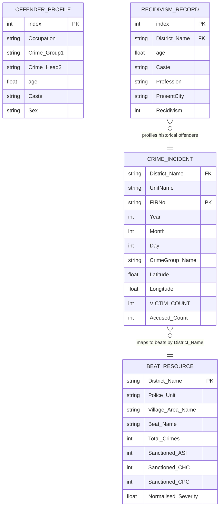

# 07. Database Analysis

This document describes the database architecture, data persistence mechanisms, storage schemas, and entity relationships of the Predictive Guardians system.

---

## 1. Database Paradigm & Persistence Strategy

The Predictive Guardians application does not use a traditional database engine (such as SQL Server, PostgreSQL, MongoDB, or SQLite). Instead, the system uses a **Flat-File Database Architecture** based on comma-separated value (CSV) files.

### Rationale
* **Hackathon Simplicity**: Minimizes operational overhead and deployment complexity for first-year engineering students.
* **Streamlit Integration**: Streamlit integrates with pandas dataframes, allowing CSV files to be loaded into memory.
* **Resource Optimization**: Reading pre-aggregated data from flat files avoids query overhead.

### Persistence Mechanism
1. **Read-Only Operations**: Static historical datasets (crime logs, offender profiles, beat allocations) are loaded directly from CSV files in `Component_datasets/` into pandas dataframes using the `@st.cache_data` caching decorator.
2. **Write Operations (Feedback Capture)**: User feedback submitted via the UI is appended to `Component_datasets/Feedback.csv`. The system reads the CSV, appends the new row, and saves the file back to disk.
3. **Data Modification (Sanctioned Strength Updates)**: When an administrator changes a district's sanctioned strength, the system updates the corresponding rows in `Resource_Allocation_Cleaned.csv` and saves the updated dataframe back to the file.

---

## 2. Entity Schemas

The following tables define the schemas for the flat-file entities stored in `Component_datasets/`:

### A. Crime Incident Entity (`Crime_Pattern_Analysis_Cleaned.csv`)
* **Total Rows**: 682,607
* **Columns**:

| Column Name | Data Type | Key/Constraint | Description |
| :--- | :--- | :--- | :--- |
| `District_Name` | String | Foreign Key | Standardized district name in Karnataka. |
| `UnitName` | String | - | Name of the local police station. |
| `FIRNo` | String | Primary Key (Composite) | Unique Case registration number (e.g. *0001/2016*). |
| `Year` | Integer | - | Year of incident. |
| `Month` | Integer | - | Month of incident. |
| `Day` | Integer | - | Day of incident. |
| `CrimeGroup_Name` | String | - | Primary crime classification. |
| `Latitude` | Float | - | Geographic Latitude coordinate. |
| `Longitude` | Float | - | Geographic Longitude coordinate. |
| `VICTIM COUNT` | Integer | - | Number of victims associated with the case. |
| `Accused Count` | Integer | - | Number of accused individuals in the case. |

### B. Offender Profile Entity (`Criminal_Profiling_cleaned.csv`)
* **Total Rows**: 53,417
* **Columns**:

| Column Name | Data Type | Key/Constraint | Description |
| :--- | :--- | :--- | :--- |
| `Unnamed: 0` | Integer | Row Index | Unique index counter. |
| `Occupation` | String | - | Suspect's profession (default *unknown*). |
| `Crime_Group1` | String | - | Crime category associated with the suspect. |
| `Crime_Head2` | String | - | Crime sub-category. |
| `age` | Float | - | Suspect's age. |
| `Caste` | String | - | Suspect's caste (default *unknown*). |
| `Sex` | String | - | Suspect's gender. |

### C. Recidivism Training Entity (`Recidivism_cleaned_data.csv`)
* **Total Rows**: 921,704
* **Columns**:

| Column Name | Data Type | Key/Constraint | Description |
| :--- | :--- | :--- | :--- |
| `Unnamed: 0` | Integer | Row Index | Unique index counter. |
| `District_Name` | String | - | Standardized district name. |
| `age` | Float | - | Offender's age. |
| `Caste` | String | - | Offender's caste. |
| `Profession` | String | - | Offender's occupation. |
| `PresentCity` | String | - | Present city of residence. |
| `Recidivism` | Integer (0/1) | Target Label | 1: repeat offender; 0: single-time offender. |

### D. Beat Resource Entity (`Resource_Allocation_Cleaned.csv`)
* **Total Rows**: 19,544
* **Columns**:

| Column Name | Data Type | Key/Constraint | Description |
| :--- | :--- | :--- | :--- |
| `District Name` | String | - | Name of the administrative district. |
| `Police Unit` | String | - | Local police station name. |
| `Village Area Name` | String | - | Local village area name. |
| `Beat Name` | String | - | Police beat identification code. |
| `Total Crimes per beat` | Integer | - | Count of incidents registered in the beat. |
| `Sanctioned Strength of Assistant Sub-Inspectors per District` | Integer | - | Total sanctioned ASI strength. |
| `Sanctioned Strength of Head Constables per District` | Integer | - | Total sanctioned CHC strength. |
| `Sanctioned Strength of Police Constables per District` | Integer | - | Total sanctioned CPC strength. |
| `Normalised Crime Severity` | Float | - | Beat severity rating relative to the district. |

### E. User Feedback Entity (`Feedback.csv`)
* **Total Rows**: Dynamic (starts with 6 records).
* **Columns**:

| Column Name | Data Type | Key/Constraint | Description |
| :--- | :--- | :--- | :--- |
| `Feedback Type` | String | - | Category (e.g. *Criminal Profiling*). |
| `Feedback Rating` | Integer | - | Score from 1 to 5 stars. |
| `Feedback Comments` | String | - | Comments submitted by the user. |

---

## 3. Entity Relationships

Although stored as independent CSV files, the entities are connected by logical keys:

