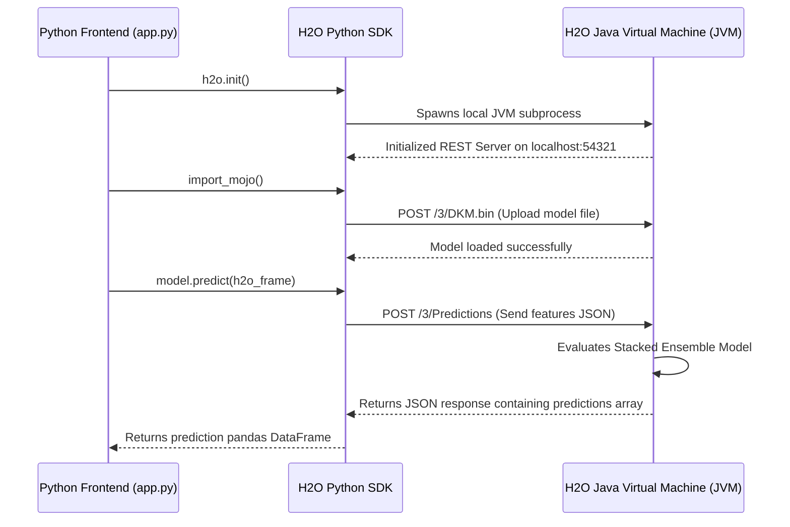

# 08. API Analysis

This document describes the external, internal, and local service integration endpoints of the Predictive Guardians system.

---

## 1. External APIs

The system calls one external HTTP REST API to retrieve geospatial boundaries:

### Karnataka District GeoJSON API
* **Endpoint URL**: `https://raw.githubusercontent.com/adarshbiradar/maps-geojson/master/states/karnataka.json`
* **Protocol**: HTTP GET (Secure SSL)
* **Authentication**: None (Public repository)
* **Request Flow**:
  1. The user navigates to the **Crime Pattern Analysis** screen.
  2. The frontend invokes the `@st.cache_data` load method `load_data()`.
  3. The `requests` library sends an HTTP GET request to the GitHub raw URL.
* **Response Flow**:
  * GitHub returns a `200 OK` response with a JSON payload containing geo-coordinate lists representing district polygons.
  * The frontend reads the district names from `properties.district` to align crime counts with district areas.
* **Failure Handling**:
  If the network call fails, the dashboard will not render district choropleth maps, resulting in a blank map area or python error output. No local fallback file is packaged in the repository.

---

## 2. Integrated Communication Protocols

The system uses standard mail protocols to handle continuous learning alerts and notifications:

### SMTP E-mail Services
* **Host Server**: `smtp.gmail.com`
* **Connection Port**: `587`
* **Transport Encryption**: StartTLS (`server.starttls()`)
* **Authentication**: Username and Password authentication:
  * **Sender Account**: `app.technicalteam@gmail.com`
  * **Password Source**: Loaded from the environment variable `EMAIL_PASSWORD` via `os.environ.get('EMAIL_PASSWORD')`.
* **Request Flow**:
  1. The rating average drops below `3.5` (via `alert.py`) or a user clicks "Send Invitation mail" (via `feedback.py`).
  2. The service creates a `MIMEMultipart` object containing HTML/text body paragraphs and attaches `Component_datasets/Feedback.csv`.
  3. The service establishes an SMTP session with Gmail, upgrades to TLS, authenticates, and sends the message.
* **Response Flow**:
  * The SMTP server returns a delivery success status.
  * Streamlit displays a green success card: *"Feedback session invitation email have been sent to [email_address]."*

---

## 3. Internal REST Interface (H2O Engine)

When executing machine learning predictions, the H2O framework uses an internal HTTP server architecture:

### Details
* **Host Address**: `http://localhost:54321` or similar dynamic local ports.
* **Protocol**: HTTP/1.1 REST JSON API.
* **Authentication**: None (Runs locally on a sandbox environment).
* **Communication Interface**: The H2O Python SDK communicates with the Java JVM via HTTP calls, mapping API commands (model loading, scaling, scoring) to corresponding REST endpoints.
* **Deployment Prerequisite**: Java Runtime Environment (JRE) must be installed on the host system to run the backend engine.

---

## 4. API Endpoints Reference Table

| Target Service | Protocol | Endpoint / Port | Authentication | Payload Format | Purpose |
| :--- | :--- | :--- | :--- | :--- | :--- |
| **GitHub Raw Maps** | HTTPS GET | `https://raw.githubusercontent.com/...` | None | JSON Polygon Coordinates | Fetches Karnataka district boundaries for Choropleth plots. |
| **Google SMTP** | SMTP TLS | `smtp.gmail.com:587` | User Credentials (`EMAIL_PASSWORD`) | MIME Multipart (CSV attachment) | Sends alerts and meeting invitations. |
| **Local H2O REST** | HTTP | `localhost:54321` | None | JSON / Binary objects | Handles communication between the Python SDK and the Java-backed JVM. |
