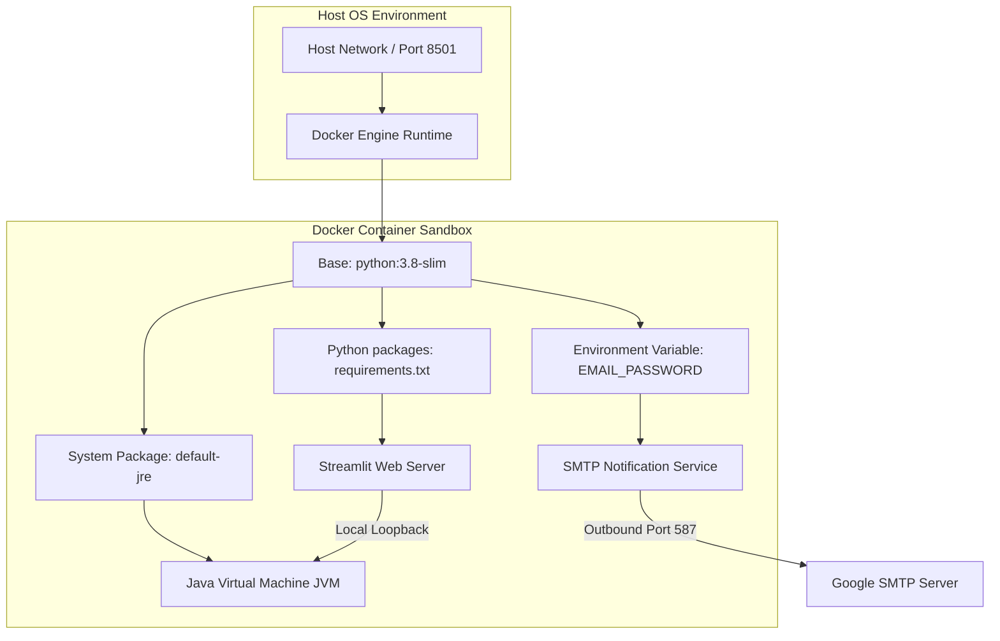

# 09. Deployment Analysis

This document describes the deployment workflows, environment configurations, container architecture, dependencies, and deployment bugs of the Predictive Guardians platform.

---

## 1. Deployment Architecture Diagram

The system deployment options include a standalone container configuration (using the Dockerfile) and a developer container configuration (using the VSCode Devcontainer spec).



---

## 2. Dockerfile & Dependency Breakdown

### Docker Container Configuration (`dockerfile`)
* **Base Image**: `python:3.8-slim` (minimal Debian Linux with Python 3.8 pre-installed).
* **Work Directory**: `/app`
* **Directory Layout inside Container**:
  * `app/` is copied to `/app/app/`
  * `models/` is copied to `/app/models/`
  * `requirements.txt` is copied to `/app/requirements.txt`
* **Java Setup**:
  Runs `apt-get update && apt-get install -y default-jre && apt-get clean` to install the Java Runtime Environment (JRE). This is a prerequisite for the H2O Java Virtual Machine backend.
* **Python Virtual Environment**:
  Creates a virtual environment and activates it before running `pip install -r requirements.txt`.
* **Port Mapping**:
  `EXPOSE 8501` mappings allow external traffic to connect to the Streamlit web server.

### System & Python Dependencies
* **System Packages (`packages.txt`)**:
  * `default-jre`: Installs Java runtime required by the H2O framework.
* **Python Libraries (`requirements.txt`)**:
  * `streamlit`: Renders the web interface.
  * `numpy`, `pandas`: Data structures and operations.
  * `plotly`, `matplotlib`, `seaborn`: Visualization libraries.
  * `statsmodels`: Implements time-series and seasonal trends.
  * `folium`, `streamlit-folium`: Map rendering libraries.
  * `scikit-learn`: DBSCAN clustering.
  * `pulp`: Linear programming optimizer.
  * `category_encoders`: Categorical encoding preprocessing.
  * `h2o`: ML model execution.
  * `imblearn`: Random oversampling and undersampling.

---

## 3. Devcontainer Configuration (`.devcontainer/devcontainer.json`)

For development in VSCode or GitHub Codespaces, the platform includes a devcontainer configuration:
* **Development Base Image**: `mcr.microsoft.com/devcontainers/python:1-3.11-bullseye` (Debian Bullseye with Python 3.11).
* **VSCode Extensions**: Automatically installs the Python extension (`ms-python.python`) and Pylance (`ms-python.vscode-pylance`).
* **Environment Setup Command (`updateContentCommand`)**:
  ```bash
  [ -f packages.txt ] && sudo apt update && sudo apt upgrade -y && sudo xargs apt install -y <packages.txt; [ -f requirements.txt ] && pip3 install --user -r requirements.txt; pip3 install --user streamlit; echo '✅ Packages installed and Requirements met'
  ```
  This command updates the repository, installs the JRE package defined in `packages.txt`, and installs requirements.
* **Post-Attach Run Command (`postAttachCommand`)**:
  ```bash
  streamlit run app/app.py --server.enableCORS false --server.enableXsrfProtection false
  ```
  This command starts the Streamlit application on container startup.

---

## 4. Deployment Prerequisites & Assumptions

1. **Java Installation**: The host environment must have a Java Runtime Environment (JRE) installed and configured on the path. If JRE is missing, the ML prediction page will fail when trying to load H2O.
2. **Environment Variable Configuration**:
   The SMTP mail services require the environment variable `EMAIL_PASSWORD` to be set:
   * **Linux/macOS**: `export EMAIL_PASSWORD="your_app_password"`
   * **Windows (PowerShell)**: `$env:EMAIL_PASSWORD="your_app_password"`
   * **Docker Run**: `docker run -e EMAIL_PASSWORD="your_app_password" -p 8501:8501 image_name`
3. **Network Connections**: The host environment needs outbound access to:
   * `github.com` (to fetch the map geojson files).
   * `smtp.gmail.com:587` (to send alert emails).

---

## 5. Critical Dockerfile Bug

* **Bug Location**: `dockerfile` lines 11 and 33:
  ```dockerfile
  COPY app/ /app/app/
  ...
  CMD ["streamlit", "run", "app.py"]
  ```
* **Impact**:
  The directory is copied to `/app/app/`, placing the entry point script at `/app/app/app.py`. Since the working directory is `/app`, the command `streamlit run app.py` will fail because `app.py` is not directly in `/app`.
* **Fix**:
  Change the startup command in the Dockerfile to:
  ```dockerfile
  CMD ["streamlit", "run", "app/app.py"]
  ```
