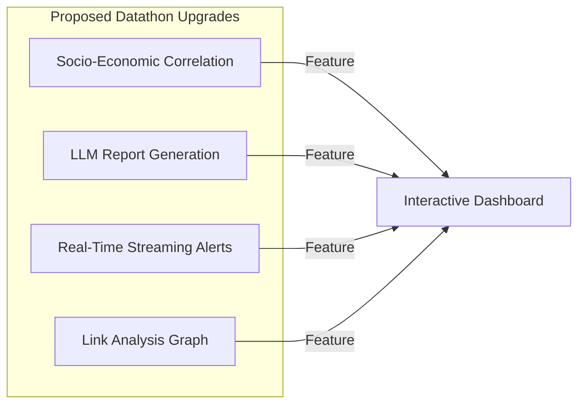

# 10. Improvements and Opportunities

This document identifies system bugs, design limitations, technical debt, and product opportunities for Predictive Guardians. These recommendations can serve as a roadmap to improve the project for hackathon evaluations.

---

## 1. Technical Improvements & Bug Fixes

### A. Critical Bug Fixes (Required for Stability)

#### 1. Fix the Training Pipeline Argument Mismatch
* **Issue**: In `pipelines/training_pipeline.py`, `train_recidivism_model` is invoked with four arguments:
  ```python
  train_recidivism_model(X_train, X_test, y_train, y_test)
  ```
  However, in `Predictive_Modeling/Recidivism_Prediction/train_model.py`, the function signature accepts only one argument:
  ```python
  def train_recidivism_model(cleaned_data):
  ```
* **Solution**: Align the function signature and calls. Modify the training pipeline to pass the consolidated dataframe, or update the model training module to accept the split datasets.

#### 2. Fix the Directory Creation Logic in Feature Engineering
* **Issue**: In `Predictive_Modeling/Recidivism_Prediction/transform_data.py`:
  ```python
  output_dir = os.path.abspath('../models/Recidivism_model')
  encoding_file_path = os.path.join(output_dir, 'frequency_encoding.json')

  if not os.path.exists(encoding_file_path):
      os.makedirs(encoding_file_path)
  ```
  `os.makedirs` is called on the file path itself, which creates a directory named `frequency_encoding.json` and prevents the JSON output file from being written.
* **Solution**: Check and create the parent directory instead:
  ```python
  if not os.path.exists(output_dir):
      os.makedirs(output_dir, exist_ok=True)
  ```

#### 3. Fix the Dockerfile Entry Point Command
* **Issue**: The Dockerfile copies files to `/app/app/` but runs the command `CMD ["streamlit", "run", "app.py"]`, which fails because the script is at `/app/app/app.py`.
* **Solution**: Modify the startup command to:
  ```dockerfile
  CMD ["streamlit", "run", "app/app.py"]
  ```

#### 4. Restore the Missing Crime Type Prediction Module
* **Issue**: The codebase contains references to `ingest_crime_type_data` and `train_crime_type_model` in the pipeline and UI scripts, but the files and models are missing.
* **Solution**: Restore the `Predictive_Modeling/Crime_Type_Prediction/` folder, or remove the commented-out code from the Streamlit UI to avoid confusing users.

---

### B. Scalability, Performance, and Security Improvements

* **Database Migration**:
  * **Current State**: Uses CSV flat-files loaded in memory. This approach will not scale as the dataset grows.
  * **Improvement**: Migrate to a relational database like PostgreSQL or SQLite. Use SQL queries to fetch data instead of loading large CSV files into memory.
* **Model Inference Optimization**:
  * **Current State**: Initializing the H2O JVM takes time and uses significant memory.
  * **Improvement**: Export the Stacked Ensemble model to a standard formats like ONNX, or convert it to a lighter format (e.g. Scikit-learn Random Forest or XGBoost) to reduce runtime dependency on Java.
* **Secure Credential Management**:
  * **Current State**: Uses an environment variable `EMAIL_PASSWORD` to store Gmail credentials.
  * **Improvement**: Use a secure secrets manager (like HashiCorp Vault, AWS Secrets Manager, or Google Secret Manager) to retrieve credentials at runtime.

---

## 2. Product and UI/UX Improvements

### A. Analytics and Visualization
* **Add a Local GeoJSON Fallback**:
  * **Current State**: Fetching district boundaries depends on a GitHub URL, which makes the app vulnerable to network failures.
  * **Improvement**: Store the GeoJSON file locally in `Component_datasets/` to allow offline rendering.
* **Interactive Hotspot Overlays**:
  * **Current State**: DBSCAN cluster markers are rendered statically on a separate Folium map.
  * **Improvement**: Combine heatmaps and DBSCAN markers into a single interactive layer using Folium clusters, and add detailed search functionality.
* **Predictive Explanations (Explainable AI)**:
  * **Current State**: The recidivism prediction tool only outputs a binary warning or success message.
  * **Improvement**: Display feature importances (e.g. using SHAP values) to show users *why* the model predicted a high risk of repeat offense.

---

## 3. Datathon/Hackathon Upgrades

To make the project more competitive in a hackathon, consider the following upgrades:



### A. Socio-Economic Correlation Analysis
* **Concept**: Integrate public census data (such as literacy rates, unemployment figures, and population density) with the crime database.
* **Value**: Allows users to study the correlation between socio-economic factors and crime rates.

### B. Generative AI / LLM Report Builder
* **Concept**: Integrate a Large Language Model (e.g. via Gemini API) to generate PDF reports for administrators.
* **Value**: Adds a modern generative AI feature to the platform.
* **Workflow**:
  ```text
  [Selected District & Allocation Table] ──> [LLM Prompt Builder] ──> [Gemini API] ──> [Polished Executive PDF Report]
  ```

### C. Link Analysis and Criminal Networks
* **Concept**: Build a network visualization graph using libraries like `networkx` or Pyvis to map relationships between offenders, crime groups, and locations.
* **Value**: Helps investigators track gangs and criminal networks visually.

### D. Real-Time Kafka / Streaming Simulation
* **Concept**: Simulate a real-time feed of incoming emergency calls (e.g. using a Kafka broker or a Python websocket server).
* **Value**: Demonstrates how the system can process live feeds instead of relying on batch updates.
