# CrimeNexus AI

**Unified operational intelligence for law enforcement — connecting structured crime records into real-time dashboards, geospatial maps, network graphs, and executive reports.**

<p>
  
  
  
  
  
  
  
  
</p>

<p align="center">
  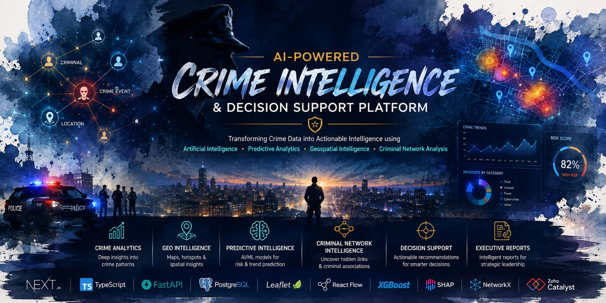
</p>

---

## Table of Contents

1. [Overview](#1-overview)
2. [Problem Statement](#2-problem-statement)
3. [Why CrimeNexus AI](#3-why-crimenexus-ai)
4. [Platform at a Glance](#4-platform-at-a-glance)
5. [Architecture](#5-architecture)
6. [Workflow](#6-workflow)
7. [Technology Stack](#7-technology-stack)
8. [Product Tour](#8-product-tour)
9. [Backend Architecture](#9-backend-architecture)
10. [Database Overview](#10-database-overview)
11. [Project Structure](#11-project-structure)
12. [API Overview](#12-api-overview)
13. [Algorithms](#13-algorithms)
14. [Installation](#14-installation)
15. [Docker](#15-docker)
16. [Configuration](#16-configuration)
17. [Deployment](#17-deployment)
18. [Future Roadmap](#18-future-roadmap)
19. [Team](#19-team)
20. [License](#20-license)

---

## 1. Overview

CrimeNexus AI is an intelligence and decision-support platform built for law enforcement agencies. It aggregates First Information Report (FIR) data, incident histories, and offender records into a single operational surface — turning rows in a CSV into district-level insight an officer can act on within minutes rather than days.

The platform is organized around a clean separation of concerns: a Next.js presentation layer, a FastAPI service layer, a dedicated analytics layer built on Pandas and NumPy, and an experimental machine learning layer. Every module — crime analytics, geospatial mapping, network intelligence, decision support, alerting, and reporting — is backed by real, queryable data rather than static mockups.

CrimeNexus AI was built by **Team InnovateX** from **Sikkim Manipal Institute of Technology (SMIT)** for **Datathon 2026**.

---

## 2. Problem Statement

Police departments generate enormous volumes of incident data — FIRs, victim and accused records, case proceedings, station-level logs — but that data is rarely operationalized. In most environments it exists as:

- Disconnected spreadsheets and paper-derived digital records with no shared schema.
- Crime patterns that are visible only in hindsight, after a hotspot has already escalated.
- Suspect and organizational links that live in an investigator's memory rather than a queryable graph.
- Patrol and resource allocation decisions made on intuition rather than incident density or officer availability.
- Executive reporting assembled manually for every review cycle, at the cost of investigator time.

The result is a reactive posture: departments respond to crime after it has occurred, with limited structural visibility into where the next incident is likely, who is connected to whom, and how thin resources should be spread across a jurisdiction.

---

## 3. Why CrimeNexus AI

CrimeNexus AI is built around a simple premise: **structured data should produce structured decisions.** Instead of a static reporting tool, it is a workspace that keeps analytics, geography, relationships, and resourcing in the same operational context.

| Principle | What it means in practice |
| :--- | :--- |
| **Single source of truth** | FIR records, crime events, offenders, and locations are normalized into one relational schema — not scattered across spreadsheets. |
| **Analysis over anecdote** | District rankings, temporal trends, and severity scores are computed from the active dataset on every load, not hardcoded. |
| **Relationships, not records** | Criminal network intelligence is modeled as a graph (via NetworkX), so investigators can trace co-offending links rather than read isolated case files. |
| **Decisions, not just dashboards** | The Decision Support Center converts raw suggestions into prioritized actions, resource allocations, and monitoring rosters. |
| **Honesty about maturity** | Every module in this README is labeled by its actual implementation status. Nothing here claims to be more finished than it is. |

---

## 4. Platform at a Glance

| Metric | Value |
| :--- | :--- |
| Platform Modules | 9 |
| Map Layers | 4 |
| Executive Report Types | 5+ |
| Active Dataset (demo) | Karnataka Crime Dataset — 5,129 records |
| Jurisdictional Coverage (demo dataset) | 31 Districts / 235 Stations |
| Registered Offenders (demo dataset) | 8,863 (3,474 flagged high-risk) |

> Figures above reflect the bundled Karnataka synthetic demo dataset used for evaluation and are not live production statistics.

---

## 5. Architecture

CrimeNexus AI follows a modular client-server architecture deployed as a serverless-friendly monorepo. The presentation layer, API layer, statistical/analytics layer, and ML layer are kept independent so each can evolve — or be replaced — without destabilizing the others.

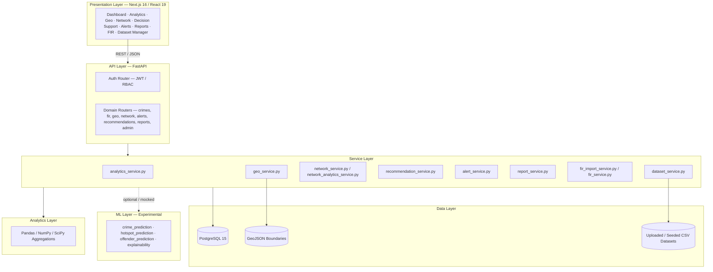

**Design philosophy.** The API layer never performs heavy computation directly — every router delegates to a service, and every service either queries PostgreSQL directly or offloads aggregation to Pandas/NumPy rather than relying on expensive relational joins. The ML layer is architecturally wired in (routers, schemas, and directories exist) but is not yet backed by trained models — this is called out explicitly rather than left ambiguous.

---

## 6. Workflow

### 6.1 End-to-end data flow

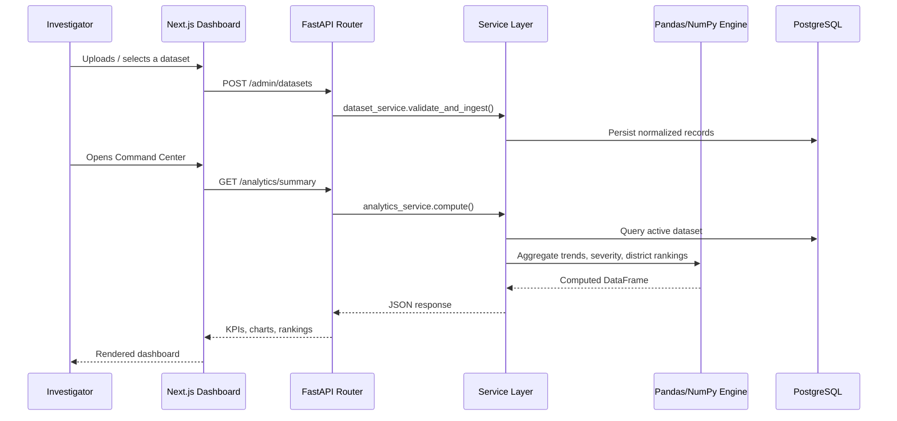

### 6.2 A typical investigator session

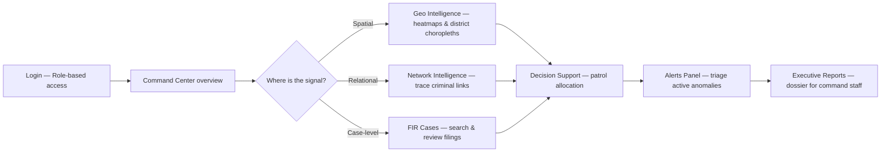

---

## 7. Technology Stack

| Layer | Technology | Notes |
| :--- | :--- | :--- |
| **Frontend Framework** | Next.js 16.2.7, React 19, TypeScript | App Router; strict typing across pages and components |
| **Styling** | TailwindCSS v4 | Utility-first, dark-mode operational UI |
| **Forms & Validation** | React Hook Form + Zod | Schema-validated FIR intake and configuration forms |
| **Charts** | Recharts ^3.8.1 | Temporal trends, category breakdowns, district rankings |
| **Maps** | Leaflet / React-Leaflet ^5.0.0 | Choropleth and marker-cluster GIS layers |
| **Graphing** | React Flow (`@xyflow/react`) ^12.11.0 | Interactive criminal network visualization |
| **Backend Framework** | FastAPI ≥0.100.0, Uvicorn | Async-first REST API |
| **ORM** | SQLAlchemy ≥2.0.0 | Declarative models across FIR, crime, and network entities |
| **Database** | PostgreSQL 15, psycopg2-binary | Relational store for all normalized data |
| **Analytics** | Pandas ≥2.2.0, NumPy ≥2.0.0, SciPy ≥1.13.0 | Off-loaded statistical aggregation |
| **Geospatial** | GeoPandas | Boundary and spatial-join operations |
| **Graph Analytics** | NetworkX | Degree centrality and structural link computation |
| **Machine Learning** | Scikit-Learn, H2O, SHAP | Configured in the dependency tree; not yet backed by trained models — see [Section 13](#13-algorithms) |
| **Authentication** | PyJWT ≥2.8.0, Passlib (`bcrypt`) | Token-based auth with hashed credentials |
| **Testing** | Pytest ≥8.3.2, pytest-asyncio | Backend test suite under `backend/tests/` |
| **DevOps** | Docker, Docker Compose | Local multi-container orchestration |
| **Deployment** | Zoho Catalyst (AppSail, Web Client Hosting, Data Store) | Serverless-style production deployment target |

---

## 8. Product Tour

### 8.1 Command Center

The Command Center is the platform's operational home page — a single view of incident volume, active investigations, resolution rate, and severity, alongside temporal trend lines and a category breakdown of the active dataset.

<p align="center">
  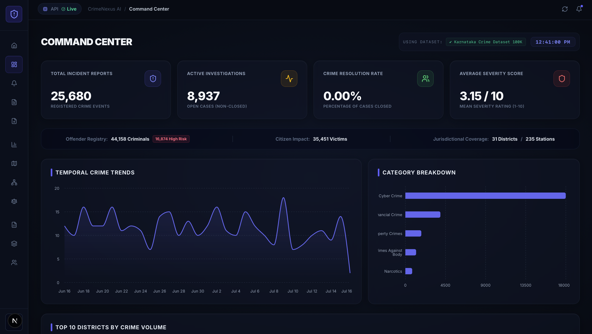
</p>

Scrolling further surfaces district-level ranking and a live feed of recent crime events, giving an investigator both the macro trend and the most recent ground truth in one screen.

<p align="center">
  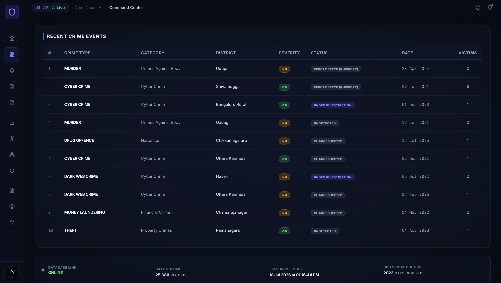
</p>


### 8.2 Dataset Manager

The Dataset Manager governs which dataset is active across the entire platform. It supports multi-file CSV/XLSX upload with validation and preview, and enforces a configurable active-dataset limit so analytics always run against a known, consistent source.

<p align="center">
  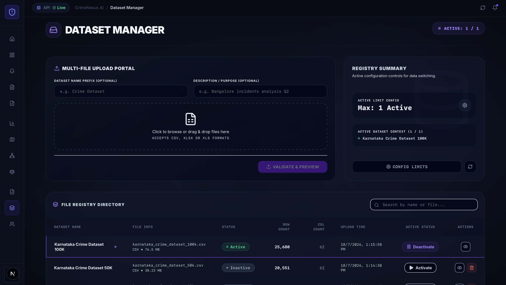
</p>

### 8.3 Crime Analytics

The Crime Analytics module aggregates incident, victim, and accused counts across the active dataset and exposes temporal analytics with daily, weekly, monthly, and yearly granularity — backed by `analytics_service.py`.

<p align="center">
  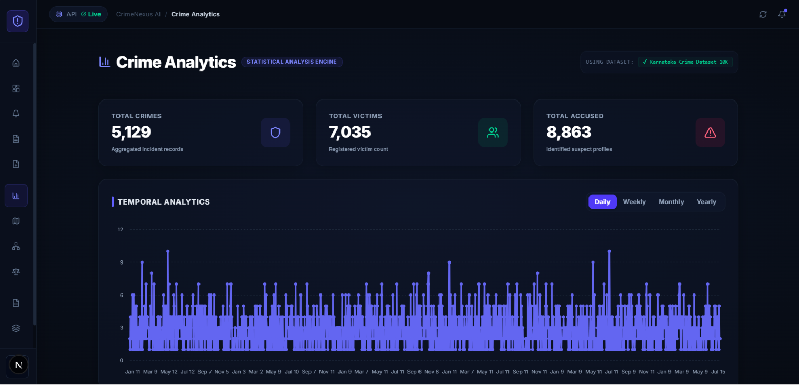
</p>

### 8.4 FIR Management

FIR Cases is the system of record for First Information Reports — searchable by crime or case number, filterable by district, status, and date range, with case status tracked through its full lifecycle (Under Investigation, Chargesheeted, B-Report, and beyond).

<p align="center">
  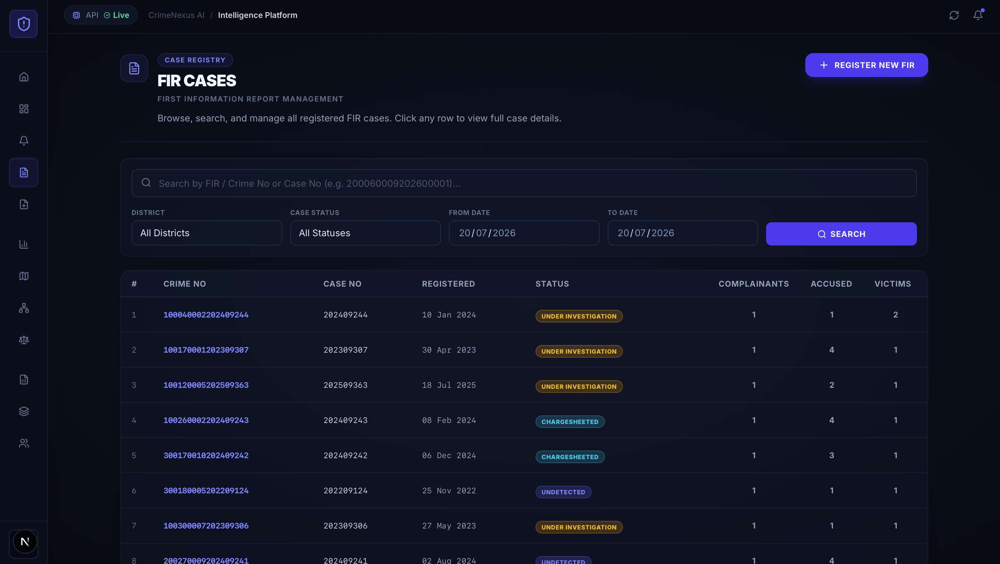
</p>

<p align="center">
  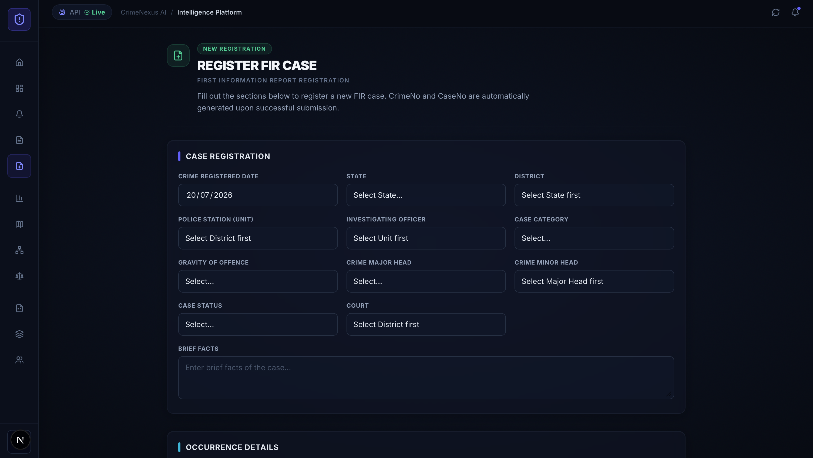
</p>

### 8.5 Geo Intelligence

The Geo Intelligence Engine renders two synchronized map layers — a district-level choropleth overlay and an operational GIS marker map with incident-density clustering — filterable by district, crime category, and date range.

<p align="center">
  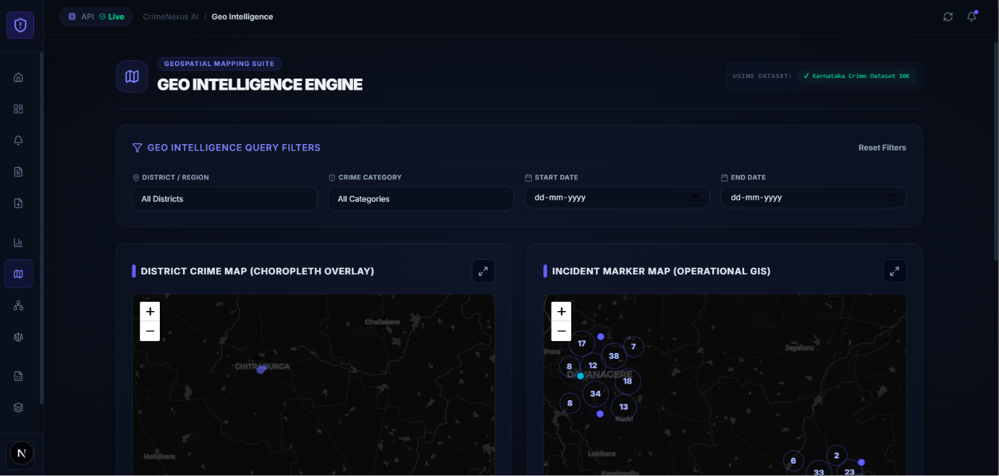
</p>

### 8.6 Network Intelligence

Network Intelligence maps relationships between offenders, crime events, and locations using NetworkX on the backend and React Flow on the frontend. An investigator can search a criminal ID, load its connection graph, and immediately see total nodes, edges, and entity-type breakdowns.

<p align="center">
  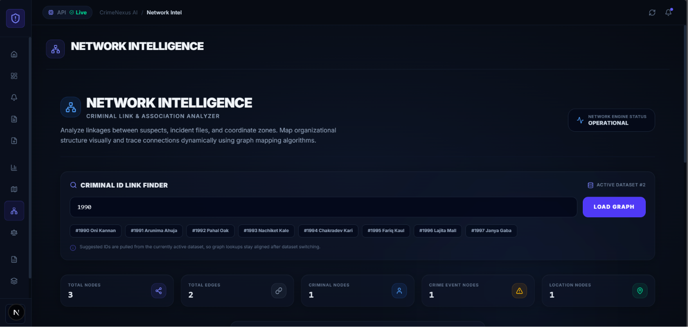
</p>

Loaded graphs render as connected cards — criminal, crime event, and location nodes — with typed relationship edges (`INVOLVED_IN`, `OCCURRED_AT`) and a risk indicator per offender.

<p align="center">
  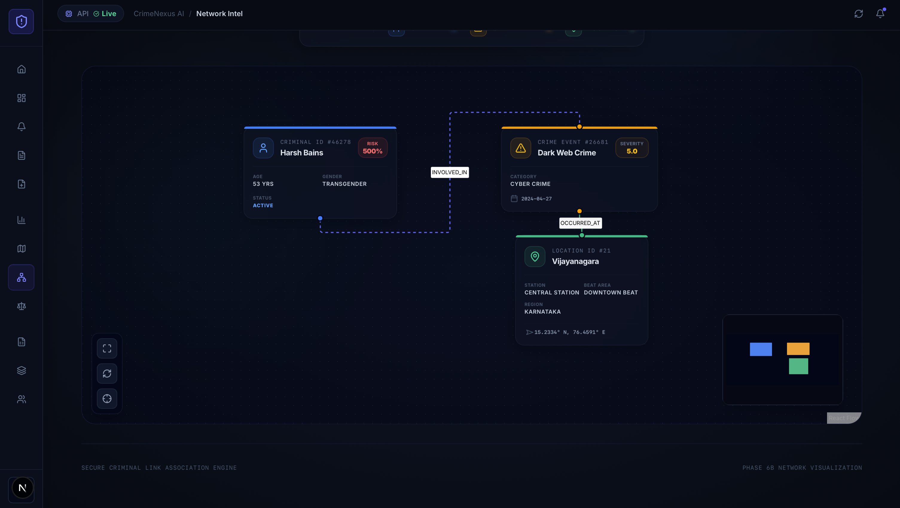
</p>

### 8.7 Decision Support

The Decision Support Center is the platform's most active analytical workspace, spanning four tabs. **Priority Actions** surfaces ranked, confidence-scored recommendations generated from the current dataset.

<p align="center">
  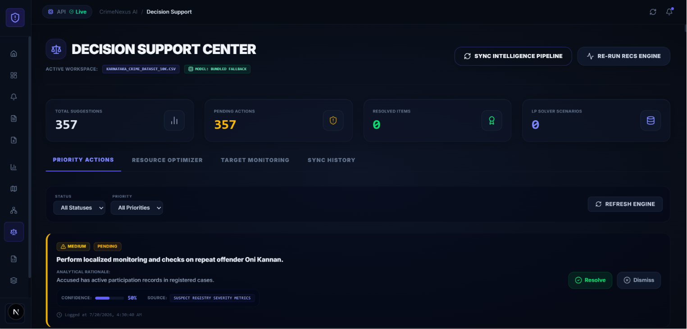
</p>

### 8.8 Alerts

The Operational Alerts Panel runs detection rules against the active dataset and triages results by severity — active, critical, resolved, and same-day counts — with a tactical dispatch view for unresolved items and a separate archive of historical alerts.

<p align="center">
  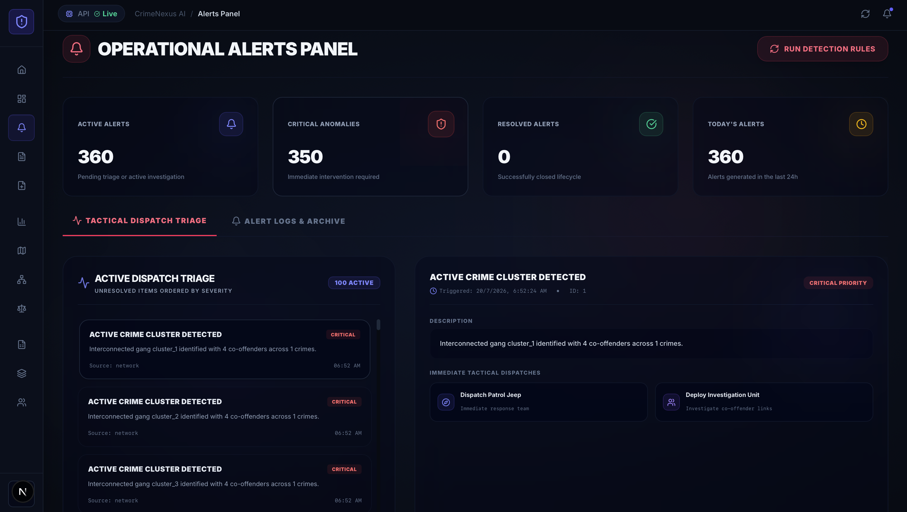
</p>

### 8.9 Executive Reports

The Executive Dossier Briefings module generates structured, parameterized reports — selectable by report type and title — and maintains a registry of previously generated dossiers for later retrieval, backed by `report_service.py`.

<p align="center">
  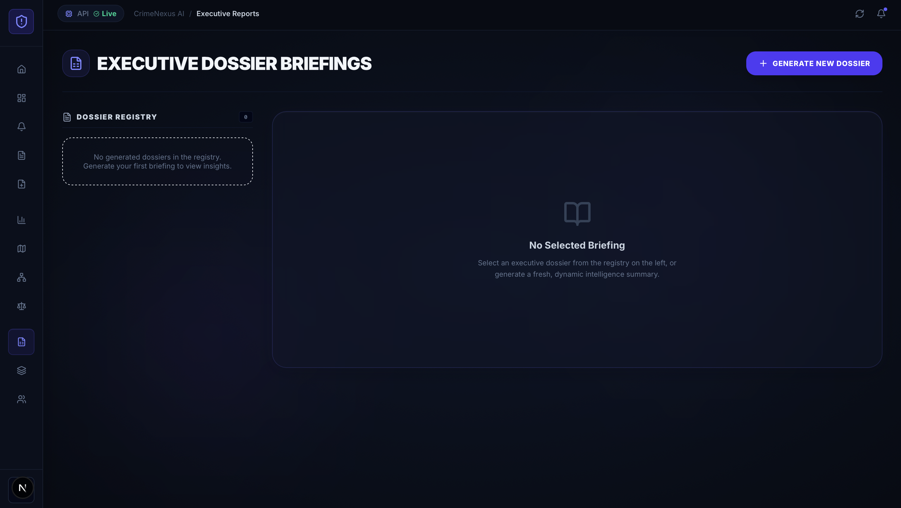
</p>

---

## 9. Backend Architecture

The backend follows a router → service → model pattern, keeping HTTP concerns, business logic, and persistence in separate layers.

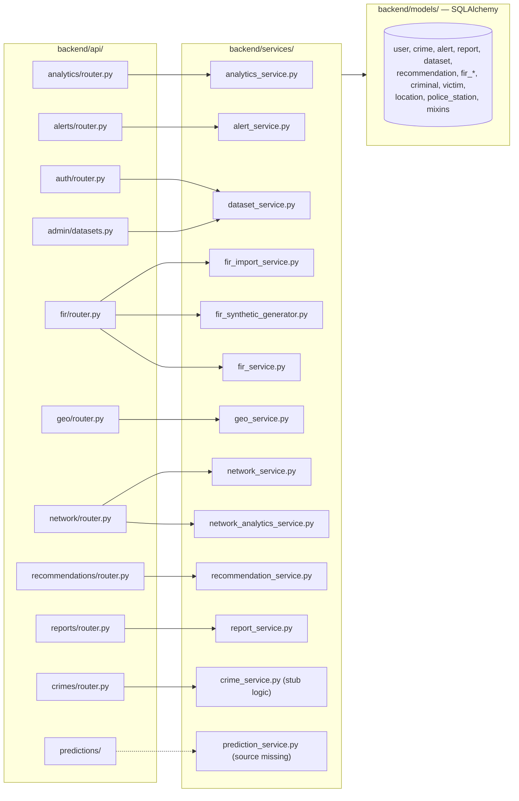

- **Validation**: handled by Pydantic schemas at the API boundary, keeping malformed input out of the service layer entirely.
- **Security**: JWT verification, role-based authorization, and bcrypt password hashing are centralized in `backend/core/`.
- **Known stub**: `crime_service.py` currently contains stub logic rather than fully implemented business rules — flagged here rather than glossed over.
- **Known gap**: `prediction_service.py` is referenced by the `predictions/` router but its Python source is not present in the repository; only pre-compiled `.pyc` artifacts exist. See [Section 13](#13-algorithms).

---

## 10. Database Overview

CrimeNexus AI's schema is designed around two anchors: a general-purpose crime/alert/reporting core, and a deep First Information Report (FIR) subsystem that models the structure of Indian criminal procedure.

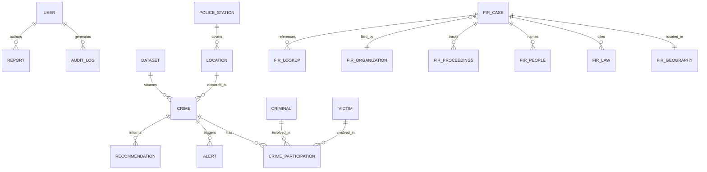

| Domain | Tables |
| :--- | :--- |
| **Core Platform** | `user`, `audit_log`, `crime`, `alert`, `report`, `dataset`, `recommendation` |
| **FIR System** | `fir_case`, `fir_geography`, `fir_law`, `fir_lookup`, `fir_organization`, `fir_people`, `fir_proceedings` |
| **Entities** | `criminal`, `victim`, `crime_participation` |
| **Spatial** | `location`, `police_station` |
| **Shared** | `mixins` (polymorphic base behavior across tables) |

The FIR subsystem — seven dedicated tables spanning geography, applicable law, involved people, organizational filing context, and procedural stage — is the platform's most structurally detailed component, closely modeling how an actual First Information Report is composed under Indian criminal procedure.

---

## 11. Project Structure

```
crimenexus-ai/
├── frontend/                  # Next.js presentation layer
│   ├── app/
│   │   ├── about/
│   │   ├── dashboard/
│   │   ├── dataset-manager/
│   │   ├── decision-support/
│   │   ├── fir/
│   │   │   └── cases/
│   │   │       ├── new/
│   │   │       ├── [id]/
│   │   │       └── [id]/edit/
│   │   ├── geo/
│   │   ├── network/
│   │   └── reports/
│   └── components/
│
├── backend/                   # FastAPI application
│   ├── api/                   # Routers — see Section 12
│   ├── services/               # Business logic — see Section 9
│   ├── models/                 # SQLAlchemy schemas — see Section 10
│   ├── core/                   # Auth, RBAC, config
│   └── tests/                  # Pytest suite
│
├── analytics/                 # Statistical calculations (yearly, monthly, geo groupings)
│
├── ml/                        # Machine learning layer (experimental / mocked)
│   ├── crime_prediction/
│   ├── hotspot_prediction/
│   ├── offender_prediction/
│   └── explainability/
│
├── database/                  # Schema management, seed scripts, backups
│
├── datasets/                  # Raw, processed, and uploaded CSV datasets
│
├── assets/                    # Static geospatial files (e.g. karnataka_boundary.geojson)
│
├── docs/                      # PROJECT_STRUCTURE.md, DEVELOPMENT_SETUP.md, deployment_guide.md
│
├── scripts/                   # Helper utilities and .bat execution scripts
│
├── infrastructure/            # Docker configurations and environment configs
│
├── docker-compose.yml
├── catalyst.json
└── .catalystrc
```

---

## 12. API Overview

All routers live under `backend/api/` and are mounted onto the FastAPI application.

| Router | Path Prefix | Responsibility | Implementation Status |
| :--- | :--- | :--- | :--- |
| `auth/router.py` | `/auth` | Authentication, JWT issuance and verification | Complete |
| `admin/datasets.py` | `/admin/datasets` | CSV/XLSX upload, validation, dataset activation | Complete |
| `alerts/router.py` | `/alerts` | Fetches and triggers threat alerts | Complete |
| `analytics/router.py` | `/analytics` | Dataframe-driven aggregations for the dashboard | Complete |
| `crimes/router.py` | `/crimes` | Incident history retrieval | Partial — service layer uses stub logic |
| `fir/router.py` | `/fir` | FIR ingestion, synthesis, and querying | Complete |
| `geo/router.py` | `/geo` | Heatmap coordinates and spatial boundaries | Complete |
| `network/router.py` | `/network` | Nodes and edges for graph visualization | Complete |
| `recommendations/router.py` | `/recommendations` | Resource allocation suggestions | Partial |
| `reports/router.py` | `/reports` | Executes and stores generated reports | Complete |
| `predictions/` | `/predictions` | ML forecasting endpoints | Mock — no trained model backing |

### Request lifecycle

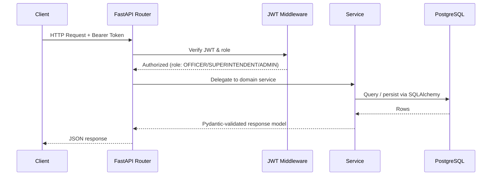

---

## 13. Algorithms

CrimeNexus AI is explicit about which analytical components are live and which are configured but not yet operational. This distinction matters for anyone evaluating the platform's real capabilities.

| Algorithm | Purpose | Status |
| :--- | :--- | :--- |
| **NetworkX (degree centrality, structural links)** | Computes offender connectivity and relationship strength for Network Intelligence | **Implemented** — `network_analytics_service.py` |
| **Pandas / NumPy aggregation pipelines** | Temporal trends, district rankings, severity scoring | **Implemented** — `analytics_service.py` |
| **DBSCAN** | Spatial density clustering for hotspot detection | Configured, not connected to a live model |
| **Linear Programming (resource allocation solver)** | Optimal officer distribution across stations | Configured, not connected to a live solver |
| **H2O Stacked Ensembles / XGBoost** | Crime and recidivism forecasting | Configured in dependencies; no trained model artifacts present |
| **SHAP** | Model explainability for predictive outputs | Configured; has nothing to explain without a trained model |

**What this means concretely:** the `ml/` directory tree (`crime_prediction/`, `hotspot_prediction/`, `offender_prediction/`, `explainability/`) contains only pre-compiled `__pycache__/*.pyc` files. No trained model artifacts (`.pkl`, `.h5`, `.mojo`, or equivalent) exist anywhere in the repository. The `/predictions` API surface currently returns mocked or placeholder responses.

This is intentional transparency, not an oversight: the platform's analytical value today comes from its statistical aggregation layer and its network-graph analysis, both of which are fully implemented and running against real data. The ML layer is scaffolded for future work — see [Future Roadmap](#18-future-roadmap).

---

## 14. Installation

### Prerequisites

| Requirement | Version |
| :--- | :--- |
| Python | 3.10+ |
| Node.js | 18+ (recommended for Next.js 16 / React 19) |
| PostgreSQL | 15 |
| npm or pnpm | Latest stable |

### Backend setup

```bash
cd backend
python -m venv venv
source venv/bin/activate      # Windows: venv\Scripts\activate

pip install -r requirements.txt

# Configure environment variables (see Section 16)
cp .env.example .env

# Apply database migrations / schema
python database/init_db.py

# Run the API
uvicorn main:app --reload --port 8000
```

### Frontend setup

```bash
cd frontend
npm install

cp .env.example .env.local

npm run dev
```

The frontend will be available at `http://localhost:3000` and will proxy API requests to the FastAPI backend at `http://localhost:8000`.

### Seeding sample data

```bash
cd backend
python -m services.fir_synthetic_generator --rows 10000 --output ../datasets/karnataka_crime_dataset_10k.csv
```

Upload the generated CSV through the **Dataset Manager** UI, or via the `admin/datasets` API, to populate the platform.

---

## 15. Docker

CrimeNexus AI ships with a multi-container `docker-compose.yml` covering the database, backend, and frontend.

| Service | Image / Build | Port | Description |
| :--- | :--- | :--- | :--- |
| `db` | `postgres:15-alpine` | `5432` | PostgreSQL database |
| `backend` | Built from `backend/Dockerfile` | `8000` | FastAPI application server |
| `frontend` | Built from `frontend/Dockerfile` | `3000` | Next.js client |

```bash
# Build and start all services
docker compose up --build

# Run in detached mode
docker compose up -d

# Tear down
docker compose down
```

Once running:

- Frontend: `http://localhost:3000`
- Backend API: `http://localhost:8000`
- API docs (Swagger UI): `http://localhost:8000/docs`

---

## 16. Configuration

Environment variables are split between the backend and frontend, and additionally mapped for Zoho Catalyst deployment via `backend/app-config.json`.

### Backend (`backend/.env`)

| Variable | Description |
| :--- | :--- |
| `DATABASE_URL` | PostgreSQL connection string |
| `JWT_SECRET_KEY` | Signing secret for issued JWTs |
| `JWT_ALGORITHM` | Token signing algorithm (e.g. `HS256`) |
| `ACCESS_TOKEN_EXPIRE_MINUTES` | Token lifetime |
| `CORS_ORIGINS` | Allowed frontend origins |
| `MAX_ACTIVE_DATASETS` | Cap on simultaneously active datasets |

### Frontend (`frontend/.env.local`)

| Variable | Description |
| :--- | :--- |
| `NEXT_PUBLIC_API_BASE_URL` | Base URL of the FastAPI backend |
| `NEXT_PUBLIC_MAP_TILE_PROVIDER` | Leaflet tile source configuration |

> Never commit populated `.env` files. Use `.env.example` as the template committed to version control.

---

## 17. Deployment

### Zoho Catalyst (primary target)

CrimeNexus AI is configured for deployment on **Zoho Catalyst**, using:

- **AppSail** — hosts the FastAPI backend as a containerized application service.
- **Web Client Hosting** — serves the built Next.js frontend as static/SSR assets.
- **Data Store** — backs persistent storage, with environment properties mapped through `backend/app-config.json`.

Deployment configuration lives in `catalyst.json` and `.catalystrc` at the repository root.

```bash
catalyst deploy
```

### Docker-based deployment

For environments outside Catalyst, the same `docker-compose.yml` used for local development can be adapted for production by supplying production environment variables and a reverse proxy (e.g. Nginx or Caddy) in front of the `frontend` and `backend` services.

### CI/CD

A GitHub Actions workflow directory (`.github/`) is present in the repository. Pipeline definitions exist but have not been fully validated end-to-end in this codebase — treat automated deployment pipelines as a work in progress rather than a verified production path.

---

## 18. Future Roadmap

| Milestone | Description |
| :--- | :--- |
| **Trained ML models** | Replace mocked prediction endpoints with actual trained crime, hotspot, and recidivism models backed by persisted `.pkl`/`.mojo` artifacts. |
| **Live DBSCAN hotspot clustering** | Connect the configured DBSCAN pipeline to real-time spatial data rather than static mock output. |
| **Linear Programming resource solver** | Activate the LP-based optimizer for genuinely optimal officer-to-station allocation, replacing the current normalized-severity heuristic. |
| **SHAP-backed explainability** | Once predictive models are trained, surface SHAP explanations directly in the Decision Support UI. |
| **`crime_service.py` full implementation** | Replace stub logic with complete incident-retrieval business rules. |
| **`prediction_service.py` source recovery** | Restore or rewrite the missing source for the predictions service currently represented only by compiled bytecode. |
| **CI/CD hardening** | Fully validate the GitHub Actions pipeline for automated test, build, and deploy stages. |
| **Expanded test coverage** | Grow the `backend/tests/` suite beyond current coverage, particularly around FIR ingestion and network analytics. |

---

## 19. Team

**Team InnovateX** — Sikkim Manipal Institute of Technology (SMIT) — Datathon 2026

<p align="center">
  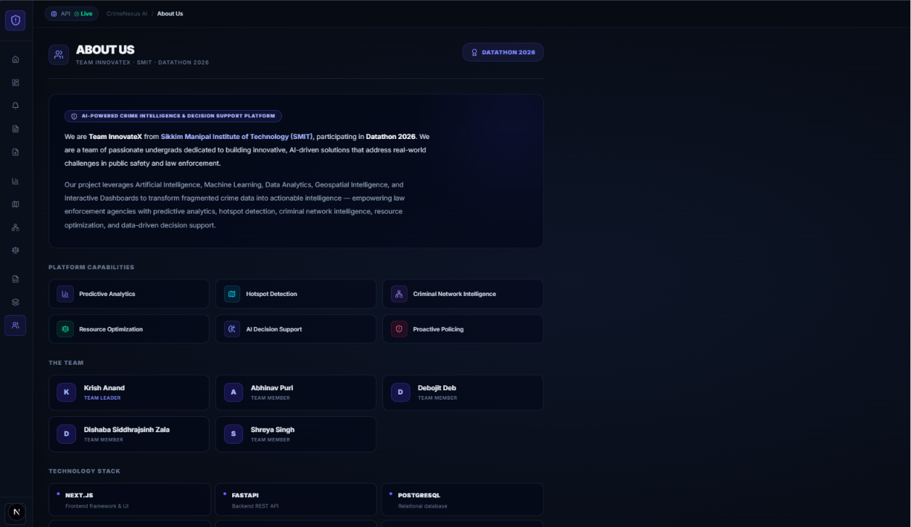
</p>

| Name | Role |
| :--- | :--- |
| Krish Anand | Team Leader |
| Abhinav Puri | Team Member |
| Debojit Deb | Team Member |
| Dishaba Siddhrajsinh Zala | Team Member |
| Shreya Singh | Team Member |

---

## 20. License

This project is released under the **MIT License**. See [`LICENSE`](./LICENSE) for full terms.

---

<p align="center">
  <sub>CrimeNexus AI — built for Datathon 2026 by Team InnovateX, SMIT.</sub>
</p>
