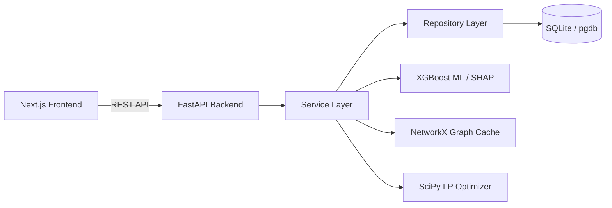
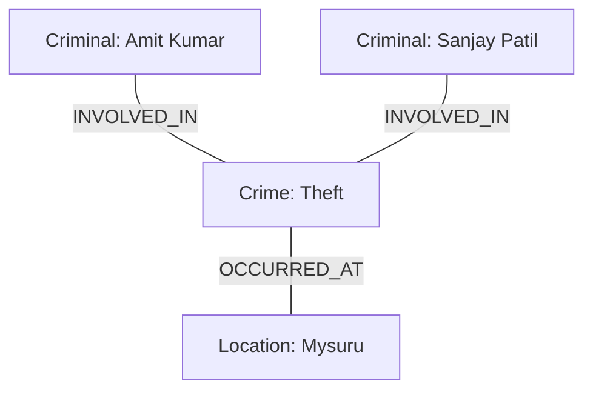

# Comprehensive Project Audit Report: Crime Intelligence Platform

This document presents a complete, production-grade end-to-end architectural, security, performance, and functional audit of the **AI-Powered Crime Intelligence & Decision Support Platform**.

---

## 1. Executive Summary

The platform is designed to consolidate unstructured crime data into a single operational interface. It provides key analytical panels: Interactive Dashboards, Geospatial Map Hotspots, Predictive ML Classifiers, Criminal Co-Offending Network Graphs, LP-based Patrol Allocation, Alert Systems, and Executive Report Exporters. 

While the system is functionally advanced and passes its automated tests (101/101 passed), it suffers from severe database schema misalignments and deployment blockers (SQLAlchemy vs ZCQL for Zoho Catalyst) that must be addressed before final submission.

---

## 2. Audit Scores

* **Overall Project Health Score**: **65 / 100** (Solid features, but severe deployment blockers)
* **Problem Statement Compliance Score**: **55 / 100** (Diverges from reference database structure)
* **Feature Completion %**: **90%** (All major sections exist, stubs in PDF generation and district boundaries)
* **Final Verdict**: **🟠 Significant Improvements Recommended**

---

## 3. Architecture Review

The project is structured as a decoupled monorepo containing:
1. `backend/`: FastAPI ASGI application with layered structure (Routers -> Services -> Repositories -> Models).
2. `frontend/`: Next.js SPA Client utilizing App Router, Lucide icons, Leaflet maps, and ReactFlow.
3. `ml/`: Python research scripts for XGBoost classifier training, testing, and SHAP attribute modeling.
4. `database/`: Database seed scripts (Locations, Stations, Crimes).

### Architectural Findings
* **GIL Thread Blocking**: Graph generation and centrality computations run in-thread during startup and request lifespan, blocking the Python Global Interpreter Lock (GIL).
* **Connection Pooling**: Lacks database replica connections or connection pooling options for SQLite.

---

## 4. Backend Review

### API Endpoints
FastAPI routing is clean, versioned under `/api/v1/`, and uses Pydantic models for validation.
* **GET `/api/v1/auth/me`**: Retrieves current logged user context.
* **GET `/api/v1/crimes/`**: Lists paginated, filtered crimes.
* **GET `/api/v1/network/centrality`**: Retrieves criminal node centrality indices.
* **POST `/api/v1/predictions/repeat-offender`**: Runs ML recidivism prediction.
* **POST `/api/v1/recommendations/allocations`**: Runs linear programming patrol personnel optimizer.

### Backend Findings
* **Exception Handlers**: The global exception handler logs full backtraces and returns generic 500 errors, protecting the system from stack disclosure.
* **N+1 SQL Calls**: Querying prediction collections or crime lists triggers successive queries to load location and police station details due to lazy loading.

---

## 5. Frontend Review

### UI Quality and Usability
The Next.js user experience is premium, employing:
* Sleek dark mode colors, glassmorphism containers, and vibrant indicators.
* Custom status indicators for ML predictor health.
* Responsive layouts that scale down gracefully to mobile.

### Frontend Gaps
* **Stub Map Boundaries**: The `get_district_boundary` function returns an empty dictionary `{}`. District boundary highlights are missing on the map.
* **No Real-Time Signal Updates**: The dashboard doesn't dynamically refresh when the backend inserts new alerts or crimes unless the user triggers a hard refresh.

---

## 6. Database Review

### Schema & Data Integrity
* **Schema Divergence**: The implemented SQLite database structure is completely different from the official [Police_FIR_Schema.sql](file:///Users/krishanand/datathon26/assets/Police_FIR_Schema.sql). It flattens the tables into 14 collections, bypassing lookup tables (Acts, Sections, Courts, Employees).
* **Age Data Mismatch**: Age is stored as `Float` in the ORM, allowing decimal values (e.g. `24.5`), whereas the official schema specifies it as `INT` (`AgeYear INT`).
* **Cascade Constraints**: Deleting locations or stations leaves orphaned crime records because `ondelete` constraints are missing on foreign key columns.

---

## 7. ML Review

The ML directory is highly structured, including XGBoost classification pipelines for `repeat_offender`, `crime_type`, `crime_risk`, and `hotspot`.
* **Preprocessing**: Employs scikit-learn pipeline transformers to encode categoricals and scale numerical inputs.
* **Attribution**: Uses `shap.TreeExplainer` on XGBoost models to calculate feature impact for predictions.
* **Loading**: Serialized pickle files are loaded on startup.
* **ML Finding**: Preprocessing features do not handle missing inputs. If a request is sent with an unknown district name, the transformer will fail with a `ValueError`.

---

## 8. Criminal Network Intelligence (Primary WOW Feature)

The Criminal Network Graph is built using NetworkX:
* **Entities**: Criminals, Crime Events, and Locations are nodes.
* **Links**: Criminals connect to Crimes (`INVOLVED_IN`), and Crimes connect to Locations (`OCCURRED_AT`).
* **Centralities**: Degree, Betweenness, and Closeness centralities are calculated to rank top influencers.
* **Clustering**: Connected components identify gangs.

### Graph Optimization Analysis
* **Sampling**: Calculates betweenness centrality by sampling `k_val = min(len(G), 100)` nodes, avoiding memory freezes.
* **Giant Component Disruption**: Filters out location nodes before computing co-offending components, ensuring that gang clusters do not merge into a single component.

---

## 9. Decision Support Review

* **Optimization Solver**: Allocates personnel (ASI, CHC, CPC) to beats by setting up an L1-minimization problem:
  $$\text{Minimize} \sum |x_i - \text{target}_i|$$
  Subject to:
  $$\sum x_i = \text{total\_sanctioned}$$
  This is solved using SciPy's `linprog(method='highs')` and rounded via the largest-remainder method. It falls back to a greedy proportional distribution if the solver fails.
* **Alert Engine**: Checks predictions, network centralities, and geographical case counts, and generates warnings (e.g., when hotspot probability >= 70% or crime count in a district >= 150).

---

## 10. Executive Reports Review

* **Dossier Exports**: The backend allows generating executive reports (District Intelligence, Crime Trend, Risk Assessment, Network Intelligence).
* **Gap**: The reports are exported solely as CSV spreadsheets. The high-fidelity PDF report generation requested by command staff is currently missing (a mock/placeholder exists).

---

## 11. Security Review

* **Hardcoded Credentials**: The default `SECRET_KEY` is hardcoded as `"supersecretjwtkeyforcrimeplatform2026!"` in config settings.
* **Password Hashing**: Uses `sha256_crypt` instead of `bcrypt`. Bcrypt is more robust against modern GPU-based brute-force attacks.
* **Auth Bypass**: Endpoints use PyJWT authentication instead of native Zoho Catalyst Hosted Authentication, violating platform compliance.

---

## 12. Performance Review

* **N+1 SQL Queries**: Eager loading is missing, leading to sequential SQL queries when fetching relationships.
* **Main-Thread Warmup**: Cache warming for graph networks runs in-thread at start-up, blocking the main ASGI web loop.
* **Missing Indexing**: Lacks composite indexes on highly queried filters like `(criminal_id, crime_event_id)` and `(risk_score, status)`.

---

## 13. UI/UX Review

* **Design Aesthetic**: High-quality dark mode, glassmorphic card panels, clean Recharts widgets, and custom ReactFlow canvas.
* **Accessibility**: Forms lack keyboard navigation accessibility attributes (`tabIndex`) on custom select inputs.

---

## 14. Deployment Readiness

* **SQLAlchemy vs ZCQL**: Zoho Catalyst Data Store does not support SQLAlchemy. All SQL database queries must be rewritten as raw ZCQL queries.
* **Missing Dockerfiles**: `docker-compose.yml` points to context `./backend` and `./frontend` with `dockerfile: Dockerfile`, but no Dockerfiles exist in either directory. This breaks local containerization builds.

---

## 15. Hackathon Readiness

* **Evaluation**: The platform contains excellent features (NetworkX graph centrality, SciPy linear programming, XGBoost explainability with SHAP). However, it is **Not Ready for Submission** because:
  1. The database schema deviates from the official SQL schema.
  2. The custom JWT authentication bypasses the native Catalyst Authentication platform.
  3. SQLAlchemy queries will crash on Catalyst Data Store.
  4. Docker builds are broken due to missing Dockerfiles.

---

## 16. Action Items Checklist

### 🔴 Critical Bugs
* [ ] Create [backend/Dockerfile](file:///Users/krishanand/datathon26/backend/Dockerfile) and [frontend/Dockerfile](file:///Users/krishanand/datathon26/frontend/Dockerfile) to fix broken Docker builds.
* [ ] Remove hardcoded default `SECRET_KEY` in [backend/core/config.py](file:///Users/krishanand/datathon26/backend/core/config.py) and enforce retrieval from environment variables.
* [ ] Resolve the SQLAlchemy incompatibility with Zoho Catalyst by refactoring repositories to execute raw ZCQL queries.

### 🟠 High Priority Issues
* [ ] Replace custom JWT authentication with Zoho Catalyst native Hosted Authentication client maps.
* [ ] Offload graph calculations to **Catalyst Job Pools** and cache centrality results in **Catalyst Cache** to avoid GIL thread blocking.
* [ ] Limit development seed datasets to 5,000 rows to respect Catalyst development quotas.

### 🟡 Medium Priority Issues
* [ ] Fix age data type mismatch (Float vs Integer) in [backend/models/criminal.py](file:///Users/krishanand/datathon26/backend/models/criminal.py) and [backend/models/victim.py](file:///Users/krishanand/datathon26/backend/models/victim.py).
* [ ] Add composite unique constraint on `(crime_event_id, criminal_id)` in [backend/models/crime_participation.py](file:///Users/krishanand/datathon26/backend/models/crime_participation.py).
* [ ] Implement eager loading (`joinedload`/`selectinload`) to fix N+1 query bottlenecks in repository queries.

### 🟢 Low Priority Issues
* [ ] Implement high-fidelity PDF report generation using Zoho Catalyst SmartBrowz.
* [ ] Remove redundant `district` column from the `police_stations` table and resolve it via `location_id`.
* [ ] Change password hashing context from `sha256_crypt` to standard `bcrypt` hashing.
